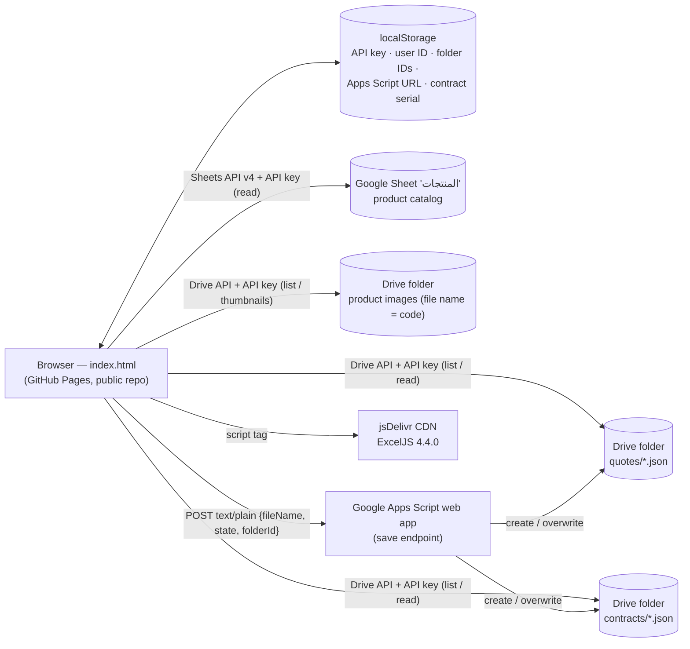

# 01 — Current-State Audit (نظام عروض الأسعار الحالي)

> Scope: `index.html` (2,283 lines, single file) and `contract.txt` on `main` as of 2026-09-25 (50 commits, 2026-03-13 → 2026-06-22).
> Purpose: capture everything the current tool does so that **no business rule is lost** in the rebuild, and list the risks that must be fixed before or during the migration.

---

## 1. What the app is today

A single-page, Arabic-first (RTL, Cairo font) **quotation and contract generator** for Motqinon Tech (متقنون تك للتجارة). It is a static page served from GitHub Pages. There is no backend of its own: the browser calls Google APIs directly.



## 2. Feature inventory (must be preserved or improved)

| # | Area | What it does today | Where (index.html) | Keep / improve in the new platform |
|---|------|-------------------|--------------------|-------------------------------------|
| 1 | Product catalog | Reads the whole sheet via Sheets API; **guesses** the code / description / price / install-cost columns with heuristics (regex for codes, longest text = description, lowest-average numeric column then "shift one column left" = price, next column = install cost) | `loadSheet()` ~L872 | Replace with a real product master (explicit fields, cost, brand, datasheet, labor, serial-tracked flag). Import the sheet once. |
| 2 | Product images | Drive folder; image file name must equal product code; thumbnails via `drive.google.com/thumbnail` | `loadImages()`, `getImg()` | Object storage with multiple images/datasheets per product. |
| 3 | Catalog search | Filter by code or description; count badge; mobile toggle | `filterCat()`, `renderCat()` | Keep (add brand/category facets, favorites, recent). |
| 4 | Quote header | Quote no., date, client name, company, project, sales rep, CR no., tax card (VAT no.), address, phone | HTML ~L525–579 | Pull from a **customer master** (account + contacts + sites) instead of retyping. |
| 5 | Quote numbering | `Q-YYYY-{userCode}{seq:3}`; next number = max found by scanning Drive file names; the admin user ID maps to code `80`; localStorage fallback | `getQuotePrefix()`, `fetchNextQuoteNumber()` | Server-side atomic sequences per company/branch/year/series; keep the same visible format so numbers continue. |
| 6 | Lines | Add product once (no duplicates); qty; editable unit price; original total shown struck-through when price is lowered; price `0` shows **FREE**; inline-editable description with "modified" marker; drag-and-drop reorder; delete | `addItem()`, `renderQuote()`, `updatePrice()` … | Keep all; add sections/groups, optional lines, alternatives, per-line discount, cost & margin (internal), notes per line. |
| 7 | Installation line (INS) | Auto-computed = Σ(product install cost × qty), always last; user can override (`_manualPrice`) or delete (`_insDeleted` stops auto re-add); manual "add installation" button | `syncInsRow()` ~L1040 | Generalise into **labor items** (labor hours or fixed labor per product, per labor type: installation / programming / cabling), still shown as one INS line if preferred. |
| 8 | Discount | Overall discount as % **or** fixed SAR (mutually exclusive, last typed wins); hidden when 0 | `getDiscountAmount()` | Keep + approval thresholds, margin guardrail, per-line discounts, reason codes. |
| 9 | VAT | 15% toggle; computed on (subtotal − discount) | `recalc()` | Tax engine with tax codes (15% standard, 0% zero-rated, exempt, out-of-scope) and exact rounding rules (ZATCA-aligned). |
| 10 | Notes & terms | Default technical notes + terms (payments 50/40/10, 45–60 working days, prices estimated pending site visit, 2-year warranty, 10-day validity, supply & install) | `DOMContentLoaded` ~L793–808 | Template library (per product line / project type), validity date field, clause library. |
| 11 | Print / PDF | Browser print, A4 portrait, page-break control, print "mirrors" for textareas, fixed orange footer on every page; **auto-saves before printing** | `doPrint()`, `@media print` | Server-side PDF (Chromium) with the same look; **archive every issued PDF** immutably; QR/verification link. |
| 12 | Excel export | ExcelJS: RTL sheet, banner, info grid, item table with product images, totals | `exportToExcel()` | Keep as an export option; add CSV/XLSX export for every list. |
| 13 | Save / load | Save JSON through Apps Script (create or overwrite by file name); search by quote number; browse by 2-digit user code or `*` | `saveQuoteToDrive()`, `listUserQuotes()`, `searchQuoteInDrive()` | Database records with status, owner, versions (revisions R1, R2…), full-text search, filters, list views. |
| 14 | Admin navigation | The hard-coded admin user ID sees ← → buttons to walk through all quotes | `navigateQuote()` | Replaced by list views, filters and permissions. |
| 15 | Contract generation | Builds an editable contract from the current quote: contract no. `MTQCT-{serial}`, quote no., date, title/subtitle, parties (client from quote; supplier hard-coded), preamble, 8 articles (attachments; specs & price table with editable qty/price; scope; payments 50/40/10 **with amounts in Arabic words (تفقيط)**; bank account/IBAN; 45–60 working-day delivery conditioned on advance + written approvals of specs, door directions, room numbers, design; KSA jurisdiction; 2-year warranty + 10-year spare parts; two original copies), signature blocks, company stamp image | `openContract()`, `ctRecalc()`, `tafqit()` | Contract module with clause library, payment-schedule builder (any % / milestones), e-signature, and automatic creation of **billing milestones** and a **project**. Reuse the `tafqit()` logic (port to server + unit tests). |
| 16 | Contract save / load | Saves the **raw contract HTML** as JSON (`{html, contractNo, quoteNo, savedAt}`); serial kept in **localStorage** and incremented on first save | `saveContract()`, `loadContractFromDrive()` | Structured contract data + rendered PDF archive; server-side serials. |
| 17 | Settings | User ID, Google API key, sheet ID/name, three Drive folder IDs, Apps Script URL, contract serial; admin-only contract buttons | `openSettings()` | Real login, roles and a company/branch settings area (no technical IDs for end users). |

### Business rules embedded in the code (carry over exactly)

1. **Line total** = unit price × qty; subtotal = Σ line totals (INS included).
2. **INS amount** = Σ(installCost × qty) over non-INS lines unless manually overridden or deleted.
3. **Discount** applies to the subtotal (before VAT); fixed discount is capped at the subtotal.
4. **VAT** = 15% × (subtotal − discount) when enabled; grand total = after-discount + VAT.
5. **Price lowered below list price** → show original total struck-through (sales transparency on the printout).
6. **Price 0 → "FREE"** on screen, print and contract.
7. **Payment schedule** (contract): 50% at signing, 40% before delivery to site, 10% after programming — amounts are percentages of the VAT-inclusive grand total and are spelled out in Arabic words.
8. **Delivery clock** starts only after (a) advance payment received **and** (b) written client approval of specs, door directions, room numbers and design → this is a natural **project stage gate**.
9. **Warranty**: 2 years from installation & actual operation, manufacturing defects + programming faults; exclusions listed; **spare parts guaranteed for 10 years** from supply → requires an **installed-base registry** with install dates.
10. Quote validity 10 days (in terms text only — not enforced).

### Data formats to migrate

Quote file (`quotes/Q-YYYY-NNNNN.json`, `version: 1`):

```json
{
  "version": 1, "quoteNo": "Q-2026-80012", "quoteDate": "2026-05-21",
  "clientName": "", "clientCo": "", "project": "", "salesRep": "",
  "crNumber": "", "taxCard": "", "clientAddress": "", "clientPhone": "",
  "items": [{ "code": "MI-K80", "desc": "…", "price": 2160, "unitPrice": 2160, "qty": 1,
              "installCost": 0, "_isAuto": false, "_manualPrice": false,
              "_descModified": false, "_origDesc": "…" }],
  "discountPercent": 0, "discountValue": 0, "discMode": "pct", "vatEnabled": true,
  "techNotes": "…", "terms": "…", "savedAt": "2026-05-21T10:00:00.000Z"
}
```

Contract file (`contracts/MTQCT-N.json`): `{ "html": "<div class=\"ct-page\">…", "contractNo": "MTQCT-72", "quoteNo": "Q-…", "savedAt": "…" }` — the contract is stored **only as edited HTML**, so totals/parties must be re-extracted during migration (see [05-roadmap.md § Migration](05-roadmap.md#5-data-migration-plan)).

---

## 3. Risk assessment

Severity: 🔴 Critical · 🟠 High · 🟡 Medium · ⚪ Low

| # | Sev. | Finding | Impact | Fix (quick win → target) |
|---|------|---------|--------|---------------------------|
| R1 | 🔴 | **Customer data is exposed publicly.** The way the tool reads quotes and contracts (API key only, no user sign-in) requires the Drive folders to be publicly shared, and this repository is **public**. | Client names, mobiles, addresses, CR/VAT numbers, prices and discounts are exposed to the internet. PDPL exposure and competitive leakage. | **Now:** restrict folder sharing to the company domain and switch the page to Google sign-in (OAuth) — see Phase 0. **Target:** private database; no direct browser access to storage. |
| R2 | 🔴 | **`contract.txt` contains a real signed contract** (client company, CR number, representative name and mobile, amounts, bank details) in the public repository. | Personal data of a client's representative published (PDPL); commercial terms public. | Owner decision: remove the file, consider purging it from git history, and/or make the repository private. |
| R3 | 🟠 | **No authentication.** Identity is a self-typed user ID; typing the hard-coded admin ID in Settings unlocks admin features (contracts, navigation over all quotes). | Anyone can impersonate any user or the admin; no accountability. | Google sign-in + allow-listed admin emails (Phase 0) → full identity & RBAC (Phase 1). |
| R4 | 🟠 | **Unauthenticated write endpoint.** The Apps Script save endpoint does not verify who is calling it. | Quotes and contracts could be overwritten or planted by an outsider. | Verify a Google ID token in Apps Script and restrict target folders to a server-side allow-list (Phase 0). |
| R5 | 🟠 | **Cross-site scripting (XSS).** Data from the sheet, client fields and saved contract HTML are inserted into the page without escaping (28 `innerHTML` call sites). | Tampered data could run script in a staff member's browser. | Add an `escapeHtml()` helper for all templates and sanitize loaded contract HTML with DOMPurify (Phase 0). Target: framework auto-escaping + structured contracts. |
| R6 | 🟡 | API key lives in `localStorage` and is used from the browser. | Key abuse/quota theft if unrestricted. | Restrict the key by HTTP referrer and to Sheets + Drive APIs only; remove it entirely once OAuth is in place. |
| R7 | 🟡 | **Numbering races.** Next quote number = max(file names) + 1 computed in the browser (first 1,000 results only); contract serial lives in one browser's localStorage. | Duplicate numbers across tabs/devices; last save silently overwrites the other quote with the same file name. | Server-side atomic sequences (Phase 1). |
| R8 | 🟡 | No versioning or audit trail (only Drive revision history); no record of **what was actually sent** to the client (PDFs are not archived). | Disputes on price/scope cannot be settled from the system. | Immutable issued-document archive + audit log (Phase 1). |
| R9 | 🟡 | Supplier identity, representative names, phone numbers, bank details, VAT rate and payment split are **hard-coded** (and already drifted: `contract.txt` and the code name different representatives). | Wrong legal data on contracts; every change needs a code edit. | Company profile & document settings (Phase 1). |
| R10 | ⚪ | Floating-point money math (`Math.round(x*100)/100`). | Off-by-one-halala differences, especially once e-invoices must reconcile with ZATCA rules. | Decimal/integer-halala arithmetic with explicit rounding rules. |
| R11 | ⚪ | Heuristic sheet parsing (column guessing + "shift left" adjustment). | A column added to the sheet can silently change prices. | Explicit product schema. |
| R12 | ⚪ | Third-party script from CDN without Subresource Integrity; no Content-Security-Policy. | Supply-chain risk. | Add SRI + CSP now; bundle dependencies in the new platform. |
| R13 | ⚪ | Maintainability: 2,283-line single file, HTML built in template strings, no tests, no build, commit messages like "fix2"/"8". | Every change risks regressions; hard to grow into an ERP. | New modular codebase with tests and CI (Phase 1). |

## 4. Gap analysis vs. an ERP + CRM + accounting platform

| Capability | Today | Gap |
|-----------|-------|-----|
| Login, users, roles | ❌ self-typed ID | Real identity, MFA, roles, record-level permissions, audit |
| Customer master (CRM) | ❌ retyped per quote | Accounts, contacts, sites, dedup, history, 360° view |
| Leads & pipeline | ❌ | Lead capture (WhatsApp, forms, referrals), stages, follow-ups, forecasting |
| Quote lifecycle | Partial (create/print/save) | Status (draft → sent → accepted/lost), revisions, approvals, validity, e-acceptance, win/loss reasons |
| Contracts | Partial (HTML generator) | Clause library, e-signature, milestones → billing, repository |
| Invoicing + ZATCA Phase 2 | ❌ | Tax invoices (standard/simplified), credit/debit notes, XML/QR/clearance/reporting |
| Payments & receivables | ❌ | Receipts, payment links (mada/Apple Pay), statements, aging, reminders |
| Projects / installation tracking | ❌ | Templates, stage gates, tasks, Gantt, site survey, snag list, handover, profitability |
| Field service | ❌ | Work orders, scheduling, technician mobile app, checklists, signatures |
| Installed base & warranty | ❌ | Device registry (serial/MAC/IP/firmware), warranty dates, RMA, AMC |
| Procurement & inventory | ❌ | Suppliers, PR/RFQ/PO, receiving, warehouses, serials, landed costs, valuation |
| General ledger & finance | ❌ | Chart of accounts, journals, AP, bank reconciliation, VAT return, statements |
| HR & payroll | ❌ | Employees, iqama/document expiry, attendance, leave, payroll (GOSI, WPS), EOSB, commissions |
| Reports & dashboards | ❌ | Sales, pipeline, margins, projects, cash, stock, service KPIs |
| Notifications & messaging | ❌ | WhatsApp/SMS/email templates, reminders, customer updates |
| Customer portal | ❌ | Online quote acceptance, invoices, payments, project progress, tickets |
| IoT-connected service | ❌ | Device health from ThingsBoard → automatic tickets (company differentiator) |

## 5. Phase 0 — immediate hardening of the current app (1–2 weeks)

These keep the current tool safe while the new platform is being built:

1. **Stop public exposure (R1, R2):** change Drive sharing of the quotes/contracts folders to company-only; replace API-key reads with Google Identity Services (OAuth "Sign in with Google", `drive.readonly`/`drive.file` scopes); decide about `contract.txt` and repository visibility.
2. **Real identity for admin features (R3):** derive the user from the Google account; admin = allow-listed emails, not a typed number. Keep the numeric user code only as a *label* for quote numbering.
3. **Protect the save endpoint (R4):** Apps Script verifies the Google ID token and only writes to allow-listed folder IDs.
4. **XSS (R5):** add `escapeHtml()` to all template literals that interpolate data; sanitize contract HTML with DOMPurify on load; add CSP + SRI (R12).
5. **Key hygiene (R6):** restrict the API key by referrer and API; rotate it after the OAuth switch.
6. **Config out of code (R9):** move company/representative/bank/VAT settings into a settings sheet read at start-up.
7. **Back up everything:** export all quote and contract JSON files (plus the product sheet and images) to a dated archive — this becomes the input for migration.

> Phase 0 is intentionally minimal: no new features, only risk reduction and a clean data export for the migration.
