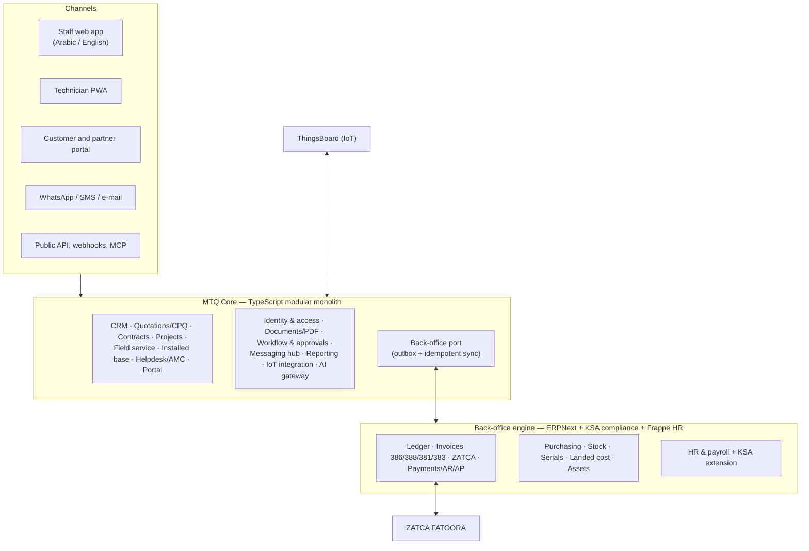
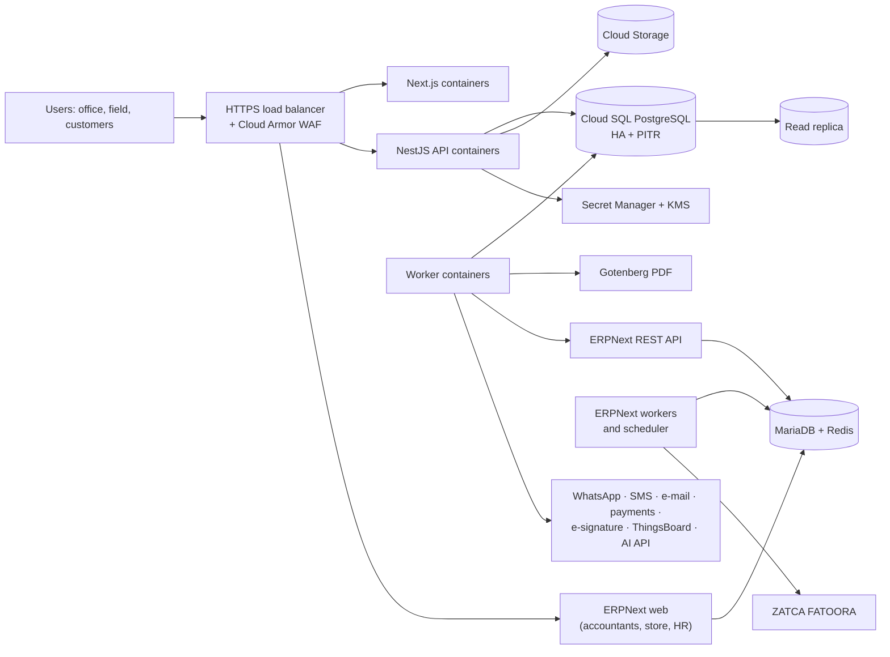
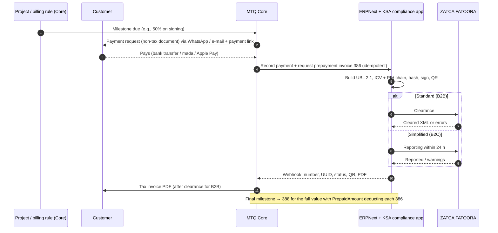

# 03 — Target Architecture (البنية المستهدفة)

> Decisions in this document are **accepted defaults** (the owner asked to adopt every recommended answer). Each one is recorded as an ADR in §14 and can be revisited at a phase gate.

## 1. Architecture principles

1. **Arabic-first, bilingual by design** — RTL is the default layout; every label, template and document supports Arabic and English; Hijri dates available on demand. Locales are always pinned explicitly (`ar-SA-u-ca-gregory-nu-latn` for main dates, `ar-SA-u-ca-islamic-umalqura` for the secondary Hijri date) because a bare `ar-SA` silently formats dates in Hijri.
2. **Compliance by construction** — ZATCA e-invoicing, VAT, PDPL and Saudi Labor Law rules live in data and tested code, never in someone's memory.
3. **One front door, clear systems of record** — staff work in one Arabic-first application; every business object has exactly **one owning system** (§3) and all others hold references.
4. **Don't rebuild commodity back office** — general ledger, ZATCA signing, stock valuation and payroll run on a proven open-source ERP; our engineering effort goes where no product fits the integrator/IoT workflow.
5. **Issued documents are immutable** — a sent quote, signed contract or cleared invoice is frozen and archived (PDF + hash; XML for invoices). Changes create a revision, change order or credit note.
6. **Modular monolith first** — one deployable with strict module boundaries; extract a service only for a proven need.
7. **Multi-company, multi-branch, tenant-ready** — `tenant_id` + PostgreSQL Row-Level Security from day one keeps a SaaS option open at little cost.
8. **API-first** — every UI action goes through a documented API (OpenAPI), reused by the technician app, customer portal, integrations and AI agents.
9. **Offline-tolerant field work** — technicians keep working in basements and new towers without signal.
10. **Secure by default** — least privilege, phishing-resistant MFA for privileged roles, audit everything, encryption, data hosted in Saudi Arabia.
11. **Configuration over code** — numbering series, templates, approval rules, automations, custom fields, tax codes, GOSI rates and leave rules are data with effective dates.
12. **AI drafts, humans approve** — AI proposes quotes, replies, matches and summaries; a person confirms anything that leaves the company, touches the ledger or issues a tax document.

## 2. Build vs. extend — decision

| Criterion | A. Extend Odoo only | B. Extend ERPNext only | C. Build everything | **D. Hybrid (chosen)** |
|-----------|--------------------|------------------------|---------------------|------------------------|
| Replace today's quote tool with the same speed & UX (INS labor line, FREE lines, strike-through pricing, tafqit) | Custom module on Odoo UI conventions | Custom app on Frappe desk conventions | Direct port | Direct port in the custom front office |
| Time to ZATCA Phase 2 | Fast — `l10n_sa_edi` is LGPL-3 in Community 19 | Fast — open KSA compliance apps | Slow & risky (UBL, XAdES, CSID onboarding, hash chain) | **Fast** — KSA compliance app on ERPNext |
| General ledger, stock valuation, landed cost, fixed assets, payroll | Mostly (some accounting reports Enterprise-only) | Complete in open source | Must be built (≈ 20+ person-months) | **Complete in open source** |
| Integrator & IoT fit (projects with gates, installed base, technician PWA, handover, IoT alarms) | Heavy customisation | Heavy customisation | Designed for it | **Designed for it** |
| Arabic UX for daily users | Good | Adequate | Best | **Best** for sales/projects/technicians; adequate for accountants |
| Ownership / future SaaS | Enterprise licence limits | GPL/AGPL back office | Full | Front office fully owned; back office swappable behind a port |
| Operating burden | One stack (Python) | One stack (Python) | One stack (TS) | Two stacks (TS + Frappe) — mitigated by managed hosting and a narrow integration contract |

**Decision:** **D — Hybrid.**
- **MTQ Core** (custom, TypeScript) is the front door and owns the differentiating domains: CRM, quotations/CPQ, contracts, projects, field service, installed base, service/AMC, helpdesk, customer portal, messaging, operational reporting, IoT and AI.
- **Back-office engine: ERPNext (v15+, GPLv3) + an open-source KSA compliance app** (LavaLoon *KSA Compliance* or ERPGulf *zatca_erpgulf*) **+ Frappe HR**, self-hosted in the same Saudi region. It owns the ledger, tax invoices & ZATCA, payments, purchasing, stock & valuation, fixed assets, bank reconciliation, VAT reporting and payroll.
- **Alternative engine:** Odoo Community 19 (its ZATCA module `l10n_sa_edi` is LGPL-3); chosen only if an Odoo-skilled implementer is available.
- **Fallback for e-invoicing:** a certified middleware API (e.g., Wafeq e-invoicing API, ClearTax, others) behind the same port if the chosen KSA app lacks a required scenario (e.g., 386 prepayment invoices).
- **Decision gate (after Phase 6):** only if the SaaS-for-integrators path is confirmed, re-evaluate replacing the engine with native modules; the back-office port (§10) keeps that option open.

## 3. Systems of record

| Domain | Owner | Mirror / reference in the other system |
|--------|-------|----------------------------------------|
| Users, roles (front office), sessions, audit | MTQ Core | Back-office users provisioned in ERPNext for finance/store/HR roles; same Google sign-in |
| Parties (customers, suppliers, partners), contacts, sites, national address | MTQ Core | Pushed to ERPNext *Customer / Supplier / Address / Contact* |
| Product catalog — commercial data (bilingual descriptions, list price, labor, packages, images, datasheets) | MTQ Core | Pushed to ERPNext *Item* (code is the shared key) |
| Product — stock data (valuation rate, stock levels, serial tracking flag, HS code, supplier catalog) | ERPNext | Valuation cost and availability pulled into Core for margins and quoting |
| Leads, opportunities, quotes, contracts, change orders, billing milestones | MTQ Core | — |
| Projects, tasks, approvals, site surveys, snags, handover | MTQ Core | ERPNext *Project* / *Cost Center* created as an accounting dimension |
| Work orders, technician visits, installed assets, warranties, tickets, AMC | MTQ Core | Serial numbers link to ERPNext *Serial No* |
| Payment requests (non-tax) | MTQ Core | — |
| Tax invoices (386/388), credit/debit notes, ZATCA submissions, receipts, AR | ERPNext | Status, number, UUID, QR, PDF link and balance mirrored to Core |
| Material requests | MTQ Core (from project BOQ) → created in ERPNext | ERPNext owns the downstream RFQ → PO → receipt → bill chain |
| Stock ledger, warehouses (incl. vans & project sites), serials, landed cost, valuation | ERPNext | Core posts technician consumption / returns as stock entries |
| General ledger, bank, cheques, fixed assets, budgets, VAT return, statements | ERPNext | Finance KPIs pulled into Core dashboards |
| Employees, payroll, leave, EOSB | Frappe HR (+ KSA extension) | Core pushes site attendance, timesheets, commissions, technician incentives |

**Rules:** one owner per field; writes only through the owner's API; all syncs idempotent (outbox → consumer with idempotency keys); nightly reconciliation job compares counts and totals per entity and raises an alert on drift.

## 4. Technology stack (decided)

| Layer | Choice | Why | Alternatives considered |
|-------|--------|-----|------------------------|
| Language (Core) | **TypeScript** (strict) everywhere | One language across web, API, workers and PWA; strong fit for AI-assisted development | Python |
| Repository | pnpm workspaces + Turborepo monorepo | Shared domain packages, atomic changes | Polyrepo |
| Staff web app & customer portal | **Next.js** (App Router) + Tailwind CSS (logical properties) + shadcn/ui (Radix) + TanStack Table/Query + React Hook Form + Zod + next-intl | Mature RTL-capable ecosystem; SSR for portal pages | Vue/Nuxt |
| API | **NestJS** (REST, OpenAPI 3.1, guards, interceptors) | Module structure, DI, testability; typed SDK for web, PWA and integrations | Hono/tRPC |
| Core database | **PostgreSQL 16+** (Cloud SQL, HA, PITR) + **Drizzle ORM** + SQL migrations with RLS policies | Integrity, JSONB, Row-Level Security, reporting SQL | — |
| Back-office engine | **ERPNext v15+ (Frappe)** + **KSA compliance app** + **Frappe HR**, MariaDB + Redis, self-hosted containers | Complete open-source ledger, stock, purchasing, assets, payroll; ZATCA Phase 2 | Odoo Community 19 |
| Search | PostgreSQL full-text with Arabic normalisation (أ/إ/آ/ا, ة/ه, ى/ي, tashkeel) + `pg_trgm` | No extra infrastructure | Meilisearch/OpenSearch later |
| Jobs & schedules | **pg-boss** (Postgres-backed queue) + transactional outbox | Reliable retries (ERP sync, messaging) without extra infrastructure | BullMQ, Temporal |
| Authentication | **Better Auth** (self-hosted: Google sign-in, passkeys, TOTP, e-mail OTP/magic link, organisations, sessions, admin/impersonation, rate limiting) | Identity data stays in our Postgres in KSA (PDPL) | Keycloak (if enterprise SSO/SCIM needed later); Auth0/Clerk (data outside KSA) |
| Files | Google Cloud Storage (Dammam), private buckets, signed URLs, versioning; audit exports in a Bucket-Lock (WORM) bucket | Documents, photos, datasheets, PDFs | — |
| PDF | **Gotenberg** (headless Chromium) rendering HTML/CSS templates with self-hosted fonts; PDF/A-3b + attachments when needed | Correct Arabic shaping; current print design reused; test text searchability per font | Typst |
| BI | **In-app reports & dashboards** on versioned SQL views with RTL-capable charts (Apache ECharts); finance data pulled from ERPNext; **Metabase** optional for internal ad-hoc analysis | Power BI, Metabase and Superset have weak Arabic RTL layout | Power BI, Superset |
| Technician app | **Installable PWA** (camera, GPS, signature, barcode) with IndexedDB outbox; evaluate PowerSync if full sync is needed | One codebase | Expo (only for BLE/NFC device provisioning) |
| Messaging | WhatsApp Business Platform (Cloud API, direct or via a Saudi BSP), CST-licensed SMS provider, transactional e-mail | Contacts matched by phone **or BSUID**; message cost ledger (service messages billable from 1 Oct 2026) | — |
| Payments | Saudi gateway (mada, Apple Pay, cards, payment links) behind an adapter | Online advances and invoice payments | — |
| Observability | OpenTelemetry → Cloud Logging/Monitoring (or Grafana stack), uptime checks, PII scrubbing | — | — |
| Delivery | GitHub Actions with Workload Identity Federation, Artifact Registry, Docker, OpenTofu; preview environments per PR | No long-lived cloud keys | — |
| Testing | Vitest, API contract tests, Playwright (E2E + PDF visual regression), sync reconciliation tests against a staging ERPNext | — | — |
| AI | Claude API behind an internal AI gateway (PII redaction, audit, budgets); role-scoped MCP server | See [modules/12](modules/12-iot-ai.md) | Other LLMs via the gateway |

### Monorepo layout

```text
apps/
  web/            Next.js staff app (RTL) + customer portal route group
  api/            NestJS REST API (OpenAPI) + webhooks (WhatsApp, payments, ERPNext, ThingsBoard)
  worker/         pg-boss workers: PDF, ERP sync, messaging, imports, schedulers
packages/
  domain/         money, tax preview, tafqit, numbering, pricing & labor rules, calendars (pure TS + tests)
  db/             Drizzle schema per module, migrations, RLS policies, seed data
  erp-connector/  BackOfficePort + ERPNext adapter (REST client, doctype mappers, webhook handlers)
  ui/             RTL-first design system, charts, data grid, Gantt wrapper
  i18n/           ar / en message catalogs
  doc-templates/  HTML/CSS templates: quote, contract, payment request, service report, handover…
  sdk/            generated API client for web, PWA and integrations
erp/
  mtq_ksa/        small Frappe app: custom fields, KSA HR extension (GOSI rates, Mudad file), webhooks
infra/            OpenTofu, Docker, GitHub Actions, ERPNext deployment
docs/             this plan, ADRs, runbooks
```

## 5. Logical architecture



**Module rules (Core):** each module owns its tables (schema per module: `core`, `crm`, `sales`, `proj`, `fsm`, `svc`, `msg`, `rpt`); modules call each other through public service interfaces or domain events; every mutating endpoint = authenticate → authorise (permission + scope) → validate (Zod) → execute in a transaction → audit + domain event (outbox) → respond.

## 6. Deployment architecture (Google Cloud – Dammam `me-central2`)



- Environments: **preview** (per PR, Core only) → **staging** (Core + ERPNext on ZATCA *simulation*) → **production** (ZATCA *core*).
- Availability target 99.5%; Cloud SQL HA; MariaDB with daily backups + binlog; **RPO ≤ 15 min, RTO ≤ 4 h** for Core, **RPO ≤ 1 h** for the ERP; encrypted backups copied to a second Saudi location/provider; quarterly restore drill.
- Verify service availability (Cloud Run vs GKE Autopilot, Memorystore) in `me-central2` during the Phase 1 spike; Compute Engine VMs are the fallback for ERPNext.

## 7. Identity & access management

**Login page (P0)** — details in [modules/01](modules/01-platform-login-security.md):
- Arabic/English, branded; **"Sign in with Google"** restricted to the company domain (the team already uses Google Workspace); **passkeys** as the fast path; e-mail + password as fallback following **NIST SP 800-63B-4** (15 characters if password-only / 8 with MFA, no composition rules, breached-password check, paste allowed).
- **MFA**: at least one phishing-resistant option offered (passkeys); passkey or TOTP **mandatory** for Owner/Admin/Finance/HR/approver roles; SMS/WhatsApp codes only as a restricted fallback.
- Invitation-only onboarding, safe recovery (no security questions), throttling (≤ 100 consecutive failures, growing delays), session list & revoke, re-authentication timeouts (AAL2: 24 h absolute / 1 h idle — configurable per role), new-device alerts, step-up authentication for sensitive actions (large discounts, IBAN changes, role grants, exports).
- Technicians: device-bound sessions unlocked with platform passkeys (device biometrics).
- Customers & partners (portal): passwordless — e-mail OTP / magic link (≤ 15 min, single use) or WhatsApp OTP.
- ERPNext uses the same Google sign-in; back-office users are provisioned from Core.

**Authorisation model** (Dynamics "privilege × scope" + Salesforce field security + ERPNext document states):

| Layer | What it controls | Example |
|-------|-----------------|---------|
| Permission catalogue (resource:action) | Actions incl. submit, approve, cancel, amend, print, export, share | `quote.approve_discount`, `contract.send_for_signature`, `invoice.request` |
| Record scope per permission | own · team · branch · company · all | Rep sees own quotes; sales manager team; GM all |
| Company & branch context | Allowed companies/branches + active one; every record stamped | Makkah HQ vs Jeddah branch |
| Field-level security | Hide/lock field groups | Cost & margin hidden from reps; iqama numbers HR-only; IBAN finance-only |
| Approval limits | Per-role maximum discount %, quote value, PO value | Discount > 10% → sales manager |
| Separation of duties | Creator ≠ approver; payment creator ≠ poster | Enforced by policy checks |
| Document state gates | Draft → submitted → approved → issued; issued is immutable | Matches ZATCA credit/debit-note rules |
| Tenant isolation | `FORCE ROW LEVEL SECURITY`; app role without `BYPASSRLS`; `set_config('app.tenant_id', …, true)` per transaction | Second line of defence |

**Default roles:** Owner/Admin · General Manager · Sales Manager · Sales Rep · Pre-sales Engineer · Project Manager · Site Supervisor · Technician · Storekeeper · Purchaser · Accountant · Finance Manager · HR Officer · Customer Service · Auditor (read-only) · Customer (portal) · Partner (portal).

## 8. Platform services (Core)

| Service | Design |
|---------|--------|
| **Documents & PDF** | Templates per document type × language × version; Gotenberg rendering with self-hosted fonts (Arabic, Latin, both digit sets, riyal sign U+20C1 with "ر.س" fallback); bidi-isolated codes/phones/IBANs; repeating table headers; every *issued* document archived as PDF + SHA-256; QR verification link on quotes/contracts; tax-invoice PDFs come from the ERP (ZATCA QR) and are mirrored |
| **Numbering** | Transactional sequences per company/branch/series/year (`Q-{YYYY}-{USER}{SEQ:3}`, `MTQCT-{SEQ:3}`); tax-invoice numbers issued by the ERP |
| **Tafqit** | Port of today's `tafqit()` to `packages/domain` with unit tests (gender agreement, dual/plural, riyal/halala) + English amount-in-words |
| **Workflow & approvals** | State machines per document type; rule engine (condition → action) for automations; multi-level approvals with delegation, recall and SLA; approve from WhatsApp/mobile |
| **Messaging hub** | One outbound API (WhatsApp/SMS/e-mail/push) with category-aware templates, consent registry (PDPL Art. 25), quiet hours (promotional SMS 08:00–22:00, "-AD" sender), delivery receipts, **cost ledger**; inbound WhatsApp inbox matched by phone or BSUID |
| **Audit & timeline** | Append-only, hash-chained `audit_log` (field diffs, actor, impersonator, IP, reason) + per-record timeline; daily export to WORM storage |
| **Calendar service** | Company calendar: Sun–Thu week, public holidays (Eids, 22 Feb, 23 Sep), Ramadan hours, midday outdoor-work ban (12:00–15:00, 15 Jun–15 Sep), optional prayer-time soft blocks — used by SLAs, delivery clocks, scheduling |
| **Files** | Upload → type/size check → malware scan → private bucket; signed URLs; thumbnails; retention rules |
| **Import/export** | CSV/XLSX import wizards with mapping, dedupe preview and validation; export of every list (permission-checked, logged) |
| **Reporting** | Versioned SQL views (semantic layer), dashboards with RTL charts, drill-down, XLSX/PDF export, scheduled delivery (e-mail/WhatsApp link); finance facts synced from ERPNext |
| **Custom fields** | Admin-defined fields per entity (`custom jsonb`) on forms, filters and templates |

## 9. Invoicing & ZATCA flow (via the back-office engine)



| Contract event | Document (ERPNext) | VAT | Notes |
|---------------|--------------------|-----|-------|
| 50% received at signing | **386** prepayment invoice | Due at receipt | Request with a non-tax payment request first |
| 40% received before delivery | **386** prepayment invoice | Due at receipt | Delivery gate opens when paid |
| Programming complete | **388** for 100% with `PrepaidAmount` = the advances (net + VAT) and references to each 386 | On the remaining 10% | Final milestone |
| Advance refunded | **381** credit note against the 386 | Reverses VAT | — |
| Price/scope correction after issue | 381 / 383 referencing the original with reason | — | Never edit issued invoices |

- **EGS units:** one per branch (Makkah HQ, Jeddah) onboarded in the ERP (OTP → compliance CSID → compliance checks → production CSID); certificate-expiry alerts.
- **Phase 1 spike (before build):** confirm the chosen KSA app supports 386 + `PrepaidAmount` deduction, multiple EGS units, simulation environment, and API/webhook access to status, UUID, QR and XML. If not → contribute the gap or route through a certified middleware API via the same port.
- **Tests:** scenario pack in the simulation environment — B2B & B2C, 386 → 388 deduction, 381 against 386, discounts, zero-rated/exempt lines, FX, rejections/retries, Arabic names, ZATCA outage; reconcile counts with the FATOORA portal.
- **Archive:** signed/cleared XML + PDF retained ≥ 10 years (safe default), offline-accessible.

## 10. Back-office port & synchronisation

| Flow | Direction | Trigger | Idempotency key |
|------|-----------|---------|-----------------|
| Party (customer/supplier) upsert | Core → ERP | Create/update in Core | `party.id` |
| Item upsert | Core → ERP | Product create/update | `product.code` |
| Valuation rate & availability | ERP → Core | Stock ledger change webhook + nightly | `item_code + warehouse` |
| Project / cost center | Core → ERP | Project created | `project.id` |
| Payment received | Core → ERP (or ERP → Core for bank-reconciled receipts) | Gateway webhook / accountant entry | gateway ref / payment entry name |
| Invoice request (386/388/381) | Core → ERP | Milestone rule / accountant action | `billing_milestone.id + doc_type` |
| Invoice status, UUID, QR, PDF | ERP → Core | ERP webhook on submit/clearance | ERP invoice name |
| Material request | Core → ERP | Project BOQ approved | `material_request.id` |
| Stock consumption / return (work orders) | Core → ERP | Technician completes job | `work_order_part.id` |
| Serial numbers received | ERP → Core | Purchase receipt submit | serial no. |
| Attendance, timesheets, commissions | Core → ERP (Frappe HR) | Daily / payroll cut-off | source record id |

Implementation: outbox table in Core → `worker` delivers with retries and exponential back-off → ERPNext REST (`/api/resource/...`, API key per integration user with least privilege) → inbound ERP webhooks verified by shared secret → inbox table deduplicates. A **nightly reconciliation** compares per-entity counts and totals (open AR, invoice totals per day, stock value) and alerts on drift.

## 11. Hosting & data residency

| Provider (Saudi region) | Status on 25 Sep 2026 | Managed PostgreSQL | Fit |
|-------------------------|------------------------|--------------------|-----|
| **Google Cloud – Dammam (`me-central2`)** | Available | Cloud SQL for PostgreSQL, AlloyDB listed | **Chosen (D4)** |
| Oracle Cloud – Jeddah & Riyadh | Available (two regions → in-Kingdom DR) | Unverified | Alternative |
| Microsoft Azure – Saudi Arabia East | Announced for **Nov 2026** | Expected | Re-check at Phase 1 gate |
| AWS – Saudi region | Planned **Dec 2026** | Expected | Re-check in 2027 |
| stc (center3 / Oracle Alloy), SCCC (stc × Alibaba), Huawei Cloud Riyadh | Available | Varies (unverified) | Sovereign/local options |
| Supabase Cloud | No Saudi region | — | Not used (patterns only) |

Third-party processors outside KSA (e-mail, AI API, WhatsApp) receive the minimum data necessary, under contracts that satisfy the PDPL transfer regulation; AI calls go through the gateway with PII redaction.

## 12. Security architecture

| Control | Implementation |
|--------|----------------|
| Standards | **OWASP ASVS 5.0 Level 2**; **OWASP Top 10:2025** (A01 broken access control … A03 supply chain … A10 exceptional conditions) checked in CI; **NIST SP 800-63B-4 AAL2** for all staff |
| Identity | Google sign-in + passkeys/TOTP, invitation-only, throttling, session management, login audit, new-device alerts, step-up auth |
| Authorisation | Server-side permission + scope checks, field masks, approval limits, separation of duties, RLS tenant isolation; ERPNext role permissions mirrored for back-office users |
| Data protection | TLS 1.2+ with HSTS; CMEK at rest; **column-level encryption** for national ID/iqama, passport, IBAN and device credentials; signed URLs |
| Secrets | Secret Manager + KMS in-region; no secrets in browsers or code; Workload Identity Federation for CI |
| Web hardening | Framework auto-escaping, DOMPurify for rich text, nonce-based CSP + Trusted Types, `frame-ancestors 'none'`, SRI/self-hosted scripts, CSRF protection, secure cookies, upload scanning, fail-closed errors with correlation IDs |
| Supply chain | Lockfiles, pinned versions, Renovate, SBOM, CodeQL, secret scanning; ERPNext/KSA app versions pinned and upgraded deliberately |
| Monitoring | Audit log (hash-chained), security alerts (failed-login spikes, permission changes, large exports, after-hours admin logins), sync-drift alerts |
| Assurance | Threat model per module; external penetration test before invoicing go-live and yearly |
| PDPL | Record of processing activities, privacy notices, consent registry, data-subject request workflow, retention schedule, breach runbook (SDAIA within 72 h), DPO role assessed if biometric data is processed |
| Continuity | HA databases, PITR, off-site backups, restore drills, incident runbooks |

## 13. Integration catalogue

| System | Purpose | Method | Phase |
|--------|---------|--------|-------|
| **ERPNext back office** | Ledger, invoices & ZATCA, payments, purchasing, stock, assets, payroll | REST + webhooks via the back-office port | 1 (setup) · 3+ |
| ZATCA FATOORA | E-invoice onboarding, clearance, reporting | Through the ERPNext KSA app (fallback: certified middleware) | 3 |
| Google Workspace | Sign-in, Gmail/Calendar sync, Drive archive import | OAuth / APIs | 1–2 |
| WhatsApp Business Platform | Quotes, payment requests, reminders, inbox, service updates | Cloud API + webhooks (BSUID-aware) | 1 (send) · 2 (inbox) |
| SMS provider (CST-licensed) | OTP fallback, notifications | REST | 1 |
| E-mail provider | Transactional e-mail (SPF/DKIM/DMARC) | API | 1 |
| E-signature (DGA-licensed TSP: Signit / emdha / Sadq) | Nafath-verified contract signing | REST + webhooks | 2 |
| Payment gateway (Moyasar / HyperPay / Tap / PayTabs / Geidea) | mada, Apple Pay, cards, payment links | REST + webhooks | 3 |
| Wathq (Ministry of Commerce) | CR / unified-number lookup | REST | 2 |
| Saudi Post (SPL) National Address | Address validation | REST | 2 |
| Meta / Snapchat / TikTok lead ads | Lead capture | Webhooks / APIs | 2 |
| Banks / open banking (Lean, Tarabut) | Statement feeds | CSV/MT940 → API | 6 |
| ThingsBoard | Device provisioning, health, alarms → tickets, customer dashboards | REST + rule-chain webhooks (signed) | 7 |
| Mudad (WPS) | Salary file | File export from Frappe HR (API later) | 7 |
| AI (Claude API) | Drafting, extraction, assistants | REST via AI gateway | 2+ |

## 14. Architecture decision records

| ADR | Decision (accepted) |
|-----|---------------------|
| ADR-001 | **Hybrid:** custom TypeScript front office (MTQ Core) + ERPNext back-office engine; commodity services integrated |
| ADR-002 | Core data: PostgreSQL + Drizzle; schema per module; RLS for tenant isolation; UUIDv7 keys |
| ADR-003 | Identity: Better Auth self-hosted; Google sign-in; passkeys + TOTP; invitation-only; NIST 800-63B-4 AAL2 |
| ADR-004 | Authorisation: permission × record scope + field-level security + approval limits + document state gates |
| ADR-005 | Money as decimals; ZATCA-aligned rounding (half-up, 2 decimals, line/total reconciliation); SAR base currency |
| ADR-006 | Server-side PDF with Gotenberg; immutable issued-document archive with hashes |
| ADR-007 | ZATCA via the KSA compliance app on ERPNext; certified middleware as fallback; no custom signer unless the SaaS path is confirmed |
| ADR-008 | General ledger, stock valuation and fixed assets on ERPNext; corrections by reversal/credit note only |
| ADR-009 | Back-office port: single owner per field, outbox + idempotent consumers, nightly reconciliation |
| ADR-010 | Technician app as an offline-tolerant PWA |
| ADR-011 | Hosting: Google Cloud Dammam (`me-central2`); Oracle Jeddah/Riyadh as alternative |
| ADR-012 | In-app BI on versioned SQL views with RTL charts; Metabase optional for internal ad-hoc |
| ADR-013 | WhatsApp Business Platform as primary customer channel; BSUID-aware identity; cost ledger |
| ADR-014 | AI gateway with PII redaction; MCP server read-only first; human approval for any write |
| ADR-015 | Payroll on Frappe HR with a small KSA extension (dated GOSI rates, Mudad file, Nitaqat, document expiry); Saudi HR SaaS as fallback |
