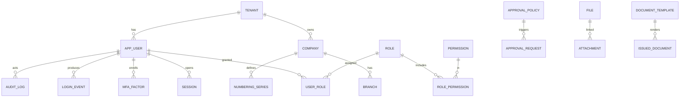
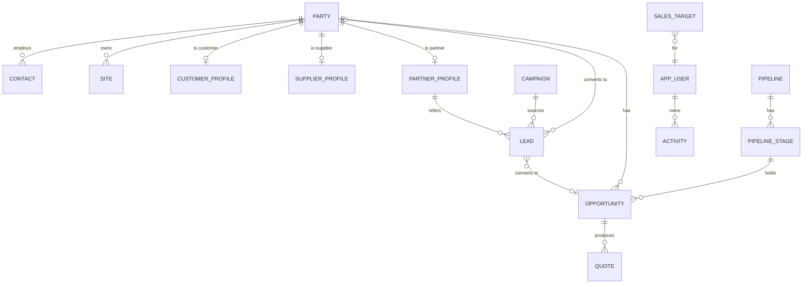
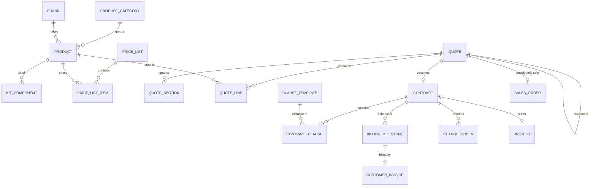
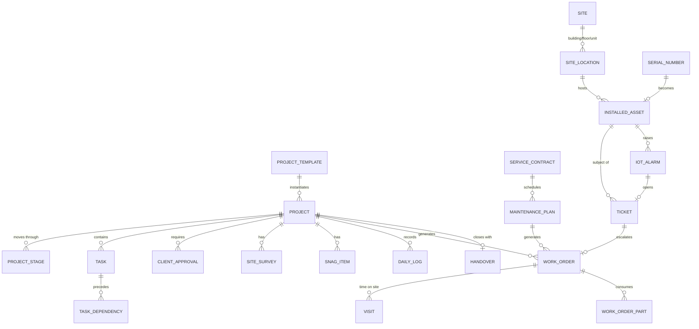
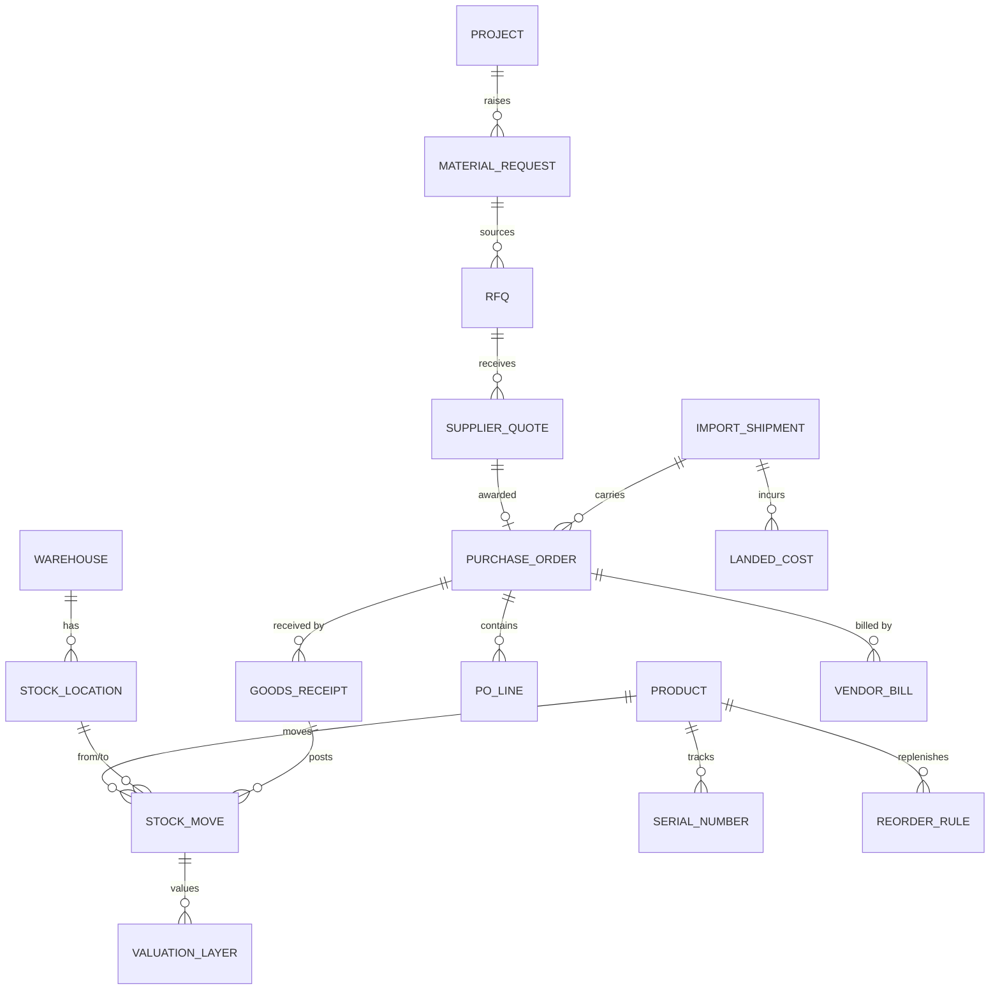
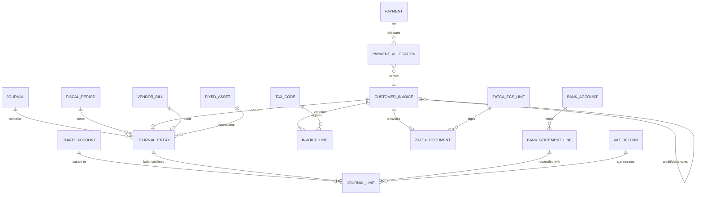
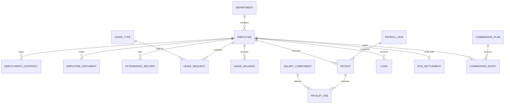
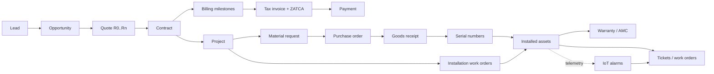

# 04 — Data Model (نموذج البيانات)

> Logical model for the whole platform, organised by module. Diagrams show the **key relationships only**; the tables below each diagram list the important fields. Physical details (indexes, partitions) are decided per module during implementation.
>
> **Where each entity lives** (see [03-target-architecture.md §3](03-target-architecture.md#3-systems-of-record)): sections 2–5 are stored in **MTQ Core** (PostgreSQL). Sections 6–8 are the logical view of data whose **system of record is the ERPNext back office**; each of those sections ends with the ERPNext doctype mapping and the mirror/reference tables Core keeps.

## 1. Conventions (apply to every table)

| Convention | Rule | Why |
|-----------|------|-----|
| Primary keys | `id UUIDv7` (time-ordered) | Globally unique, merge-safe, index-friendly |
| Human numbers | Separate `number` column filled from a **numbering series** (e.g., `Q-2026-80012`, `MTQCT-073`, `INV-2026-00001`) | Legacy formats continue; numbers never reused |
| Tenancy | `tenant_id` on every row + PostgreSQL Row-Level Security | Keeps a SaaS option open without a rewrite |
| Company / branch | `company_id`, `branch_id` on transactional rows | Multi-company, branch reporting, ZATCA per branch/EGS |
| Audit columns | `created_at/by`, `updated_at/by`, `version` (optimistic lock) | Traceability, safe concurrent edits |
| Deletion | Master data: soft delete (`archived_at`). Issued documents: **never deleted** — cancelled, voided or reversed | Legal/tax record-keeping |
| Money | `NUMERIC(18,2)` for amounts, `NUMERIC(18,4)` for unit prices, `NUMERIC(18,6)` for rates; decimal library in code (no floats) | Exact VAT/ZATCA rounding |
| Currency | Every monetary document stores `currency`, `exchange_rate`, amounts in document currency **and** company currency (SAR) | Imports in USD/CNY, reporting in SAR |
| Dates | Timestamps in UTC (`timestamptz`); business dates as `date` in `Asia/Riyadh`; Hijri shown on demand (Umm al-Qura) | Correct day boundaries and bilingual display |
| Bilingual text | Master-data names as `name_ar` + `name_en` (or `jsonb {ar,en}` for long texts) | Arabic-first documents with English mirror |
| Snapshots | Document lines copy product code/description/price at issue time | Old documents never change when the catalog changes |
| Extensibility | `custom jsonb` column + `custom_field_def` table per entity | Admin-defined fields without migrations |
| Attachments & chatter | Polymorphic `attachment`, `note`, `activity` tables keyed by (`entity_type`, `entity_id`) | One timeline on every record |
| Events | `domain_event` outbox table written in the same transaction | Reliable notifications, integrations, webhooks |

## 2. Platform & security

| Table | Key fields |
|-------|-----------|
| `company` | legal_name_ar/en, cr_number, vat_number (15 digits), national address (building no., street, district, city, postal code, additional no.), phone, email, logo/stamp file, base_currency=`SAR`, fiscal_year_start |
| `branch` | company_id, name, branch CR, address, is_head_office, default warehouse, ZATCA EGS unit |
| `app_user` | email, mobile, name_ar/en, locale, status (invited/active/suspended), **user_code** (2-digit code used in legacy quote numbers), employee_id, last_login_at |
| `role` / `permission` / `role_permission` | permission code (e.g., `quote.approve_discount`), **scope** (own · team · branch · company · all) |
| `field_permission` | role_id, entity, field, access (hidden / read / write) — e.g., hide `cost_price` from sales |
| `team`, `team_member` | sales teams, technician crews, manager |
| `session`, `mfa_factor`, `passkey`, `login_event` | device, IP, user agent, geo, result, risk flags |
| `numbering_series` | document_type, pattern (`Q-{YYYY}-{USER}{SEQ:3}`), next_value, reset (yearly/never), branch |
| `approval_policy` / `approval_request` | document_type, condition (e.g., discount % > 10 or margin % < 20), approver role/user, level, amount limit, status, comment |
| `audit_log` (append-only) | entity_type/id, action, before/after diff (`jsonb`), actor, IP, reason, at |
| `file`, `attachment` | storage key, sha256, mime, size, virus-scan status; entity link and label |
| `document_template`, `issued_document` | template per document type & language; **issued PDF archive** with hash, version, issued_by/at |
| `message_template`, `outbound_message` | WhatsApp/SMS/email templates (provider template ID, language, variables); delivery status |
| `notification` | in-app notifications per user, read_at |
| `custom_field_def` | entity, key, labels ar/en, type, options, required |
| `integration_connection`, `webhook_subscription` | provider, encrypted credential reference, status |

## 3. Parties & CRM

A single **party** table holds every organisation or person the company deals with; *roles* (customer, supplier, partner) are profile tables. This avoids duplicates when a contractor is both a customer and a referral partner.

| Table | Key fields |
|-------|-----------|
| `party` | kind (organization/individual), name_ar/en, **unified_number** (10 digits starting with 7, Commercial Register Law 2025), legacy CR numbers, CR status & last annual confirmation date, last Wathq check, vat_number (15 digits, starts and ends with 3), segment (contractor, developer, building owner, villa owner, consultant, government, hotel…), source, owner_id, parent_party_id, tags, status |
| `contact` | party_id, name, job title, mobile (E.164 +966…), **whatsapp**, **wa_bsuid / wa_username** (WhatsApp business-scoped ID — some users arrive without a phone number), email, preferred language, preferred channel |
| `consent` | contact, channel (WhatsApp/SMS/e-mail), purpose (marketing/service), status, source, wording version, captured/withdrawn at — PDPL Art. 25 evidence |
| `site` | party_id, type (billing/project/site), national address fields, city, district, lat/lng, map link, access notes |
| `customer_profile` | payment terms, credit limit, price list, receivable account, default tax code, **B2B vs B2C** flag (drives ZATCA standard vs simplified invoice) |
| `supplier_profile` | payment terms, currency, payable account, lead time, withholding-tax applicability (non-resident), rating |
| `partner_profile` | type (consultant, contractor, architect, developer, referrer), commission rate/plan |
| `lead` | source (WhatsApp, website, Snapchat/Instagram/TikTok ads, Google, referral, walk-in, exhibition), campaign, name, company, mobile, city, interest (intercom, smart home, locks, IoT), estimated units, score, status, owner, referred_by |
| `opportunity` | party, contact, site, title, pipeline & stage, amount, probability, expected close, project type (villa, building, compound, hotel, office), competitors, lost_reason, won/lost dates, owner |
| `activity` | entity link, type (call, meeting, site visit, task, WhatsApp, email), subject, due_at, done_at, outcome, GPS (for visits) |
| `campaign`, `sales_target`, `lost_reason`, `competitor` | marketing sources, quotas per rep/team/period, reason codes |

## 4. Sales — products, quotations, contracts

| Table | Key fields |
|-------|-----------|
| `product` | code/SKU, name_ar/en, description_ar/en, brand, category, type (stock / non-stock / service / **labor** / kit), UoM, list price, cost price, **install_labor_cost** (today's `installCost`), labor hours, tax code, warranty months, serial-tracked flag, HS code, country of origin, datasheet, images, status, replacement product |
| `kit_component` | kit product → component, qty, optional flag (e.g., "Villa intercom package") |
| `price_list`, `price_list_item` | sales/purchase, currency, validity, segment, min qty |
| `product_rule` | configuration rule (e.g., each 24 indoor monitors ⇒ 1 × POE-24+2 switch) — later phase |
| `quote` | number, **revision** (R0, R1…), parent_quote_id, opportunity, party, contact, site, project name, sales rep, branch, date, **valid_until**, currency, status (draft → pending approval → approved → sent → viewed → accepted / rejected / expired / lost), discount type & value, totals (subtotal, discount, taxable, VAT, total), **cost & margin** (internal), notes, terms, template, public token, accepted_at/by, signature file, lost reason, `legacy_json` for migrated quotes |
| `quote_section` | optional grouping (Building A, Villa 3, Phase 2) |
| `quote_line` | order, product, snapshot code/description, `is_description_modified`, list price, unit price, qty, line discount, line total, cost snapshot, tax code, is_optional, alternative_of, **is_labor / is_auto_labor (INS)**, manual override flag |
| `contract` | number (`MTQCT-…`), quote, party, title/subtitle, status (draft → sent for signature → signed → active → completed / terminated), dates, value incl. VAT, delivery days min/max, warranty months, spare-parts years, governing law, signed file, e-sign request |
| `contract_clause`, `clause_template` | clause library (ar/en, version, category) and per-contract copies (modified flag) |
| `billing_milestone` | contract, order, name, **percent**, amount, trigger (on signing / before delivery / after programming / date / project milestone), due date, status (pending → invoiced → paid), invoice |
| `change_order` | contract, number, description, amount delta, status, linked revision quote |
| `sales_order`, `sales_order_line` | for supply-only / walk-in sales that skip contracts |

## 5. Projects, field service, installed base & service

| Table | Key fields |
|-------|-----------|
| `project` | number, name, party, site, contract, quote, type (villa intercom, building intercom, smart home, IoT), template, status, **current stage**, dates (planned/actual), PM, budget (revenue/cost), progress %, health, warranty start/end |
| `project_template` / stages / tasks | reusable plans per project type (see [modules/05-projects.md](modules/05-projects.md)) |
| `project_stage` | stage, order, **gate conditions** (e.g., advance paid ∧ client approvals received), status, entered/completed at |
| `task`, `task_dependency` | parent task, assignee/team, dates, duration, FS/SS/FF/SF + lag, estimate vs actual hours, checklist |
| `client_approval` | type (specs, door directions, room numbering, design, material submittal), document, status (pending / approved / approved with comments / rejected), approver name, signature, date |
| `site_survey` | form template, answers, measurements, photos, surveyor, date (can hang off an opportunity before the sale) |
| `snag_item`, `daily_log`, `handover` | punch list; site diary (manpower, work done, issues, photos); acceptance certificate, as-built files, training sign-off |
| `timesheet_entry` | employee, project/task/work order, date, hours, cost rate, billable, approval |
| `site_location` | site hierarchy: building → floor → unit/apartment → room/riser |
| `installed_asset` | product, serial, **MAC, IP, firmware**, location, install & commissioning dates, warranty start/end, project, status (active / faulty / replaced / removed), parent asset, **credentials vault reference (never plaintext)**, IoT device ID, last seen, health |
| `work_order` | number, type (survey, installation, commissioning, corrective, preventive, warranty), project / service contract / ticket, site, assets, priority, status (new → scheduled → dispatched → en route → on site → completed → closed), schedule, crew, SLA due, checklist, resolution, customer signature & rating |
| `visit`, `work_order_part` | check-in/out time + GPS; parts consumed (from van stock, with serials), billable flag |
| `service_contract`, `maintenance_plan` | warranty / AMC / SLA, covered sites & assets, visits per year, response time, price, billing frequency; preventive schedule generating work orders |
| `ticket`, `sla_policy`, `business_calendar` | channel (WhatsApp, phone, email, portal, **IoT alarm**), category, priority, SLA timers; working week Sun–Thu, holidays, Ramadan hours |
| `rma` | asset/serial, supplier, reason, replacement serial, status |
| `iot_alarm` | source (ThingsBoard), device, asset, type, severity, start/clear, linked ticket |

## 6. Inventory & procurement

| Table | Key fields |
|-------|-----------|
| `warehouse`, `stock_location` | type (main, **technician van**, **project site**, transit, quarantine/RMA), branch, bins |
| `stock_move` (append-only) | product, qty, UoM, from → to location, reference (receipt, delivery, work order, transfer, adjustment), serial/lot, unit cost, state (draft / reserved / done / cancelled), done_at |
| `stock_balance` | product × location × lot: on hand, reserved, available (materialised) |
| `valuation_layer` | FIFO / moving-average layers feeding COGS and inventory GL accounts |
| `serial_number` | product, serial, MAC, status (in stock / reserved / delivered / installed / RMA / scrapped), location, receipt, supplier warranty end, installed asset |
| `reservation` | product, qty, location, reference (contract/project), expiry |
| `reorder_rule` | min/max, lead time, preferred supplier |
| `stock_count`, `stock_count_line` | cycle counts and full stock-takes |
| `material_request` | project, lines from BOQ, needed by, status |
| `rfq`, `supplier_quote` | invited suppliers, prices, lead times, validity → bid comparison |
| `purchase_order`, `po_line` | supplier, currency & rate, Incoterm, expected date, status (draft → to approve → approved → sent → partially received → received → billed → closed), project link, ordered/received/billed quantities |
| `goods_receipt` | PO, warehouse, lines with serials/MACs, quality status |
| `import_shipment` | mode, B/L or AWB, container, ETD/ETA, **customs declaration (FASAH)**, clearance agent, documents (commercial invoice, packing list, certificate of origin, SABER certificates) |
| `landed_cost` | type (freight, insurance, customs duty, clearance, local transport, SABER fees), amount, currency, allocation method (value / qty / weight / volume), vendor bill — **import VAT is not a landed cost** (recoverable input VAT) |
| `compliance_cert` | product model, type (SABER PCoC, shipment SCoC, CST type approval, IECEE RC), number, issuer, issue/expiry, file — warns/blocks POs and sales when missing or expired |
| `hs_duty_rate` | 12-digit GCC HS code, duty %, effective from/to, source |

**System of record: ERPNext.** Mapping: `warehouse`/`stock_location` → *Warehouse* (tree, incl. van and project-site warehouses) · `stock_move` → *Stock Entry* / *Stock Ledger Entry* · `stock_balance` → *Bin* · `serial_number` → *Serial No* (+ custom fields: MAC list, firmware) · `reservation` → *Stock Reservation Entry* · `reorder_rule` → *Item Reorder* · `stock_count` → *Stock Reconciliation* · `material_request` → *Material Request* · `rfq`/`supplier_quote` → *Request for Quotation* / *Supplier Quotation* · `purchase_order` → *Purchase Order* · `goods_receipt` → *Purchase Receipt* · `vendor_bill` → *Purchase Invoice* · `landed_cost` → *Landed Cost Voucher* · `import_shipment`, `compliance_cert`, `hs_duty_rate` → custom doctypes in the `mtq_ksa` app.
**Core keeps:** `erp_link` references, `stock_availability_cache` (item × warehouse: on hand, reserved, projected, valuation rate) for quoting and margins, and `work_order_part` lines that are posted to ERPNext as stock entries.

## 7. Accounting, tax & ZATCA

| Table | Key fields |
|-------|-----------|
| `chart_account` | code, name_ar/en, type (asset, liability, equity, revenue, expense), subtype (receivable, payable, bank, cash, inventory, VAT input/output, WIP…), parent, reconcilable, currency |
| `journal`, `journal_entry`, `journal_line` | journal type (sales, purchase, bank, cash, general, inventory, payroll); entry status (draft / posted / reversed), source document, reversal_of; line debit/credit, currency amount & rate, party, **analytic dimensions** (project, cost center, branch), tax code & base, due date, reconciliation ID |
| `fiscal_year`, `fiscal_period` | open / closed / **locked** (no postings into locked periods) |
| `tax_code` | rate, category (standard 15% / zero-rated / exempt / out-of-scope / reverse charge), **ZATCA category code** (S, Z, E, O) and exemption reason code, VAT-return box, GL accounts |
| `customer_invoice`, `invoice_line` | type (tax invoice 388 / credit note 381 / debit note 383 / advance-payment invoice), **standard (B2B) vs simplified (B2C)** subtype, party, contract, billing milestone, project, issue & supply dates, due date, currency, totals, paid amount, balance, status (draft → issued → cleared/reported → partially paid → paid; rejected), original invoice + reason (notes), prepayment references |
| `zatca_egs_unit` | branch, EGS serial, CSR, **compliance & production CSIDs (encrypted)**, private-key reference (KMS), certificate expiry, **ICV counter, last invoice hash (PIH)** |
| `zatca_document` | invoice, EGS, UUID, ICV, PIH, invoice hash, signed XML file, QR payload, submission type (clearance / reporting), status (pending / cleared / reported / warning / rejected / error), ZATCA response, attempts, timestamps |
| `payment`, `payment_allocation`, `cheque` | direction (in/out), method (bank transfer, mada, card, Apple Pay, STC Pay, payment link, cash, cheque), amount, currency, bank account, reference; allocations to invoices/bills; post-dated cheque lifecycle (received → deposited → cleared / bounced) |
| `bank_account`, `bank_statement_line`, `reconciliation_rule` | IBAN, GL account, feed connection (open banking); statement lines matched to journal lines; auto-match rules |
| `vendor_bill`, `vendor_bill_line` | supplier invoice number, PO/receipt links, **3-way match status**, withholding tax, attachments |
| `expense_claim` | employee, lines (date, category, amount, VAT, receipt, project), approval, reimbursement |
| `fixed_asset`, `depreciation_line` | cost, salvage, life, method, accumulated depreciation, disposal |
| `cost_center`, `budget`, `budget_line` | analytic tree; budget per account × cost center/project × period |
| `vat_return` | period, box values, status, filed reference |
| `withholding_tax_entry` | payment to non-resident, service type, rate, amount |
| `currency`, `exchange_rate` | daily rates (source, date) |

**Invoice types used by the 50/40/10 contract:** **386** prepayment invoice when each advance is received (VAT due at receipt) → **388** final tax invoice for 100% with `PrepaidAmount` deducting the advances and referencing each 386 → **381/383** credit/debit notes for corrections or refunds (never edit an issued invoice).

**System of record: ERPNext + KSA compliance app.** Mapping: `chart_account` → *Account* · `journal`/`journal_entry`/`journal_line` → *Journal Entry* / *GL Entry* (analytic dimensions: *Project*, *Cost Center*, branch) · `fiscal_period` → *Fiscal Year* + *Accounting Period* (closed periods) · `tax_code` → *Item Tax Template* / *Sales Taxes and Charges Template* (+ ZATCA category & exemption codes) · `customer_invoice` → *Sales Invoice* (KSA app fields: UUID, ICV, PIH, hash, QR, clearance/reporting status, signed & cleared XML) · `zatca_egs_unit`/`zatca_document` → KSA-app onboarding and submission-log doctypes · `payment` → *Payment Entry* (post-dated cheques via reference date + clearance date, or a custom PDC register) · `bank_statement_line` → *Bank Transaction* · `vendor_bill` → *Purchase Invoice* · `expense_claim` → *Expense Claim* · `fixed_asset` → *Asset* · `budget` → *Budget* · `vat_return` → KSA VAT report · `exchange_rate` → *Currency Exchange*.
**Core keeps:** `billing_milestone` (owner), `payment_request` (non-tax request: milestone, amount, due date, payment link, status), `invoice_mirror` (ERP name, number, type 386/388/381/383, UUID, ZATCA status, QR payload, PDF file, totals, balance due), `payment_mirror` (amount, date, method, allocation) — all written only by the back-office port.

## 8. HR & payroll

| Table | Key fields |
|-------|-----------|
| `employee` | employee no., user link, names ar/en, nationality, is_saudi, **iqama/national ID (encrypted) + expiry**, passport (encrypted) + expiry, border no., profession per iqama, department, branch, job title, manager, hire date, probation end, GOSI no., bank IBAN, medical-insurance class & expiry, driving licence expiry, cost center |
| `employment_contract` | Qiwa contract reference, type (fixed/indefinite), dates, basic salary, housing/transport/other allowances, working hours, leave days, notice period |
| `employee_document` | type (iqama, passport, visa, insurance card, licence, certificate), number, issue/expiry, file, alert days |
| `attendance_record` | check-in/out time, **GPS + project site geofence**, selfie, source (mobile/biometric), late/overtime minutes |
| `leave_type`, `leave_balance`, `leave_request` | entitlement rules per Saudi Labor Law, paid-percentage tiers, attachments, approval chain |
| `public_holiday`, `shift`, `roster` | Eid holidays, Founding Day, National Day; shifts per crew |
| `payroll_run`, `payslip`, `payslip_line`, `salary_component` | earnings/deductions, **GOSI employee/employer shares**, loans, net pay, WPS (Mudad) status; posting to GL by cost center/project |
| `loan` | amount, installments, remaining balance |
| `eos_settlement` | reason (resignation / termination / contract end…), service period, **EOSB**, leave encashment, final pay |
| `commission_plan`, `commission_entry` | basis (revenue, margin, **collections**), tiers, product filters; accrued → approved → paid via payslip |
| `statutory_rate` | scheme (GOSI annuity, SANED, occupational hazards), population (Saudi old system / Saudi new system / non-Saudi), employer %, employee %, wage floor/cap, **effective from/to** (new-system annuity steps up every 1 July until 2028) |
| `saudization_snapshot` | date, weighted Saudi count (≥ SAR 4,000 = 1, below = 0.5; Qiwa-documented contracts only), Nitaqat band, ratios per profession group (sales 60%, engineering 30%) |

**System of record: Frappe HR (on the ERPNext back office) + `mtq_ksa` extension.** Mapping: `employee` → *Employee* (+ KSA fields) · `employment_contract` → custom *Employment Contract* (Qiwa ID, authentication status) · `employee_document` → custom doctype with expiry alerts · `attendance_record` → *Employee Checkin* / *Attendance* · `leave_*` → *Leave Type* / *Leave Allocation* / *Leave Application* · `payroll_run`/`payslip` → *Payroll Entry* / *Salary Slip* · `salary_component` → *Salary Component* · `loan` → *Employee Advance* / Lending app · `eos_settlement` → *Gratuity* (+ *Full and Final Statement*) · `statutory_rate`, `saudization_snapshot`, Mudad salary file → `mtq_ksa` doctypes.
**Core keeps:** `commission_plan`/`commission_entry` (owner — it sees quotes, contracts and collections), `site_attendance_event` (technician GPS check-ins from work orders), `technician_incentive`; pushed to Frappe HR as *Additional Salary* and attendance before each payroll cut-off.

## 9. Integration tables (MTQ Core)

| Table | Key fields |
|-------|-----------|
| `erp_link` | entity_type, entity_id, erp_doctype, erp_name, last_synced_at, checksum, sync_status |
| `outbox_event` | id, aggregate, event_type, payload, created_at, delivered_at, attempts, last_error |
| `inbox_event` | source (ERPNext, WhatsApp, payment gateway, ThingsBoard, e-sign), external_id (idempotency key), payload, received_at, processed_at |
| `sync_reconciliation_run` | run_at, entity, core_count, erp_count, core_total, erp_total, status, drift details |
| `message_cost_entry` | message id, channel, category (marketing/utility/authentication/service), country, unit cost, related record — for the WhatsApp/SMS cost ledger |

## 10. Cross-module traceability ("document flow")

Every downstream record stores the upstream reference, so any screen can show the chain:

