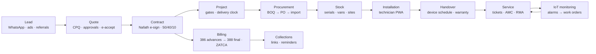

# MTQ Platform — From Quotation Tool to ERP + CRM + Accounting
# منصة متقنون — من أداة عروض الأسعار إلى نظام متكامل لتخطيط الموارد وإدارة العملاء والمحاسبة

> **Status:** plan v1.0 · 25 Sep 2026 · all open decisions resolved with the recommended answers ([decision log](05-roadmap.md#11-decision-log--recommended-answers-adopted-2026-09-25)).

## Executive summary

Motqinon Tech's quotation tool (`index.html`) already encodes valuable know-how — bilingual quotes with an auto-calculated installation line, FREE lines, strike-through pricing, VAT, contracts with 50/40/10 payment schedules and amounts in Arabic words. But it is a single browser page on Google Sheets/Drive with **no real login, publicly exposed customer data, no customer database, no invoicing and no project tracking** ([audit](01-current-state.md)).

We benchmarked the leading apps in every field — Salesforce, HubSpot, Zoho, Odoo, ERPNext, D-Tools, Portal.io, ServiceTitan, Procore, Dynamics 365, NetSuite, Qoyod, Wafeq, Jisr, ZenHR, ThingsBoard and ≈ 80 others ([benchmark](02-market-benchmark.md), [raw research](research/README.md)) — and turned ≈ 670 benchmarked features into prioritised module backlogs.

**The plan:** build **MTQ Core**, an Arabic-first TypeScript platform for everything that differentiates an integrator/IoT company (CRM, CPQ, contracts, projects, field service, installed base, service, customer portal, IoT, AI), and run the commodity back office — **ledger, ZATCA e-invoicing, purchasing, stock, payroll** — on **ERPNext with an open-source KSA-compliance app and Frappe HR**, all hosted in **Google Cloud Dammam**. Staff get one front door; accountants keep a proven ledger; ZATCA compliance arrives in weeks instead of a year ([architecture](03-target-architecture.md)).

**Delivery:** eight phases over ≈ 12 months (≈ 47–50 person-months), each ending in production use — login page and Quotations/Contracts v2 first, compliant invoicing by **December 2026**, project tracking and the technician app by **spring 2027**, full accounting mid-2027, then HR/payroll, customer portal, IoT-connected service and AI ([roadmap](05-roadmap.md)).

## Business flow the platform covers

## Key decisions (adopted)

| # | Decision |
|---|----------|
| 1 | **Hybrid architecture**: custom TypeScript front office (Next.js, NestJS, PostgreSQL) + **ERPNext** back office (ledger, ZATCA, stock, purchasing, Frappe HR) behind an idempotent sync port |
| 2 | **Login**: Google sign-in for the company domain + passkeys; TOTP/passkey mandatory for privileged roles; invitation-only; NIST 800-63B-4 & OWASP ASVS 5.0 L2 baseline |
| 3 | **Hosting in Saudi Arabia** (Google Cloud Dammam); multi-tenant-ready schema (RLS) to keep a SaaS option open |
| 4 | **ZATCA**: compliant invoicing from ERPNext by Dec 2026 (Wave 25 deadline 1 Feb 2027); 386 prepayment invoices for advances, 388 final with deductions; certified bridge SaaS now if not already compliant |
| 5 | **WhatsApp-first** customer communication (Cloud API, BSUID-aware, cost ledger) with PDPL consent |
| 6 | **Nafath-backed e-signature** for contracts via a DGA-licensed provider; OTP acceptance for quotes |
| 7 | **In-app RTL dashboards** (not Power BI/Metabase) for the 77-report catalogue |
| 8 | **Technician PWA** with serial/MAC scanning — the installed base is built during installation |
| 9 | **ThingsBoard** for IoT (reuse, don't build): alarms become tickets and uptime-based AMC tiers |
| 10 | **AI drafts, humans approve**: BOQ → quote, summaries, read-only MCP server; AI never issues tax documents |

## Phases

| Phase | Outcome | Indicative dates |
|-------|---------|------------------|
| 0 | Secure the current tool, back up data, confirm ZATCA status | Sep – Oct 2026 |
| 1 | **Login page**, users/roles, customers, products, **Quotations v2**, **Contracts v2**, dashboards v1 | Oct – Dec 2026 |
| 1F | ERPNext back office + ZATCA go-live (parallel) | Oct – Dec 2026 |
| 2 | CRM: leads, pipeline, WhatsApp inbox, online acceptance, e-signature | Jan – Feb 2027 |
| 3 | Invoicing & collections automated from contract milestones | Jan – Feb 2027 |
| 4 | **Project tracking**, work orders, technician app, installed base, handover | Feb – Apr 2027 |
| 5 | Procurement, imports, stock & serials | Feb – Apr 2027 |
| 6 | Full accounting rollout (bank, assets, VAT return, project P&L) | Apr – May 2027 |
| 7 | HR & payroll, helpdesk & AMC, customer portal, IoT & AI | Apr – Sep 2027 |

## Do this now (first two weeks)
1. **Stop the public exposure of customer data** in the current tool (company-only Drive sharing + Google sign-in) — [Phase 0](01-current-state.md#5-phase-0--immediate-hardening-of-the-current-app-12-weeks).
2. **Make this repository private and purge `contract.txt`** from git history (it contains a real client's personal data).
3. **Confirm Motqinon's ZATCA wave** on the FATOORA portal; if invoices are not Phase-2 integrated today, start a certified invoicing SaaS immediately.
4. Export all quotes, contracts, the product sheet and images to a dated archive.
5. Contract an ERPNext implementer and run the KSA-app capability spike (386/388, EGS per branch, webhooks).

## Documents

| Document | Content |
|----------|---------|
| [01 — Current-state audit](01-current-state.md) | What the tool does today, business rules to preserve, data formats, risks, Phase 0 quick wins |
| [02 — Market benchmark](02-market-benchmark.md) | Leaders per field, what they implement, what we adopt, 2025–26 innovations, gaps we can own, Saudi regulatory digest |
| [03 — Target architecture](03-target-architecture.md) | Hybrid decision, systems of record, stack, diagrams, login & authorisation, ZATCA flow, sync port, hosting, security, ADRs |
| [04 — Data model](04-data-model.md) | Entities and relationships per module, ERPNext mapping, integration tables |
| [05 — Roadmap](05-roadmap.md) | Phases, timeline, migration, team & effort, costs, KPIs, risks, decision log, first 30 days |
| [modules/01 — Platform, login & security](modules/01-platform-login-security.md) | Login page, identity, sessions, roles & permissions, audit, settings |
| [modules/02 — CRM](modules/02-crm.md) | Customers, leads, pipelines, WhatsApp, consent, forecast, partners |
| [modules/03 — Quotations & CPQ](modules/03-quotations-cpq.md) | Catalog, packages, labor (INS), approvals, revisions, web proposals, BOQ import |
| [modules/04 — Contracts & e-signature](modules/04-contracts-esign.md) | Templates, clause library, milestones, Nafath signing, change orders |
| [modules/05 — Projects](modules/05-projects.md) | Stage gates, delivery clock, approvals, surveys, snags, handover |
| [modules/06 — Field service & installed base](modules/06-field-service-assets.md) | Work orders, dispatch, technician PWA, assets, warranty/AMC, helpdesk |
| [modules/07 — Inventory & procurement](modules/07-inventory-procurement.md) | Items, kits, serials/MACs, warehouses & vans, POs, imports & landed cost, SABER/CST |
| [modules/08 — Accounting & ZATCA](modules/08-accounting-zatca.md) | ZATCA checklist, 386/388 billing, ledger, AR/AP, bank, VAT, reports |
| [modules/09 — HR & payroll](modules/09-hr-payroll.md) | Saudi labor rules, GOSI, Mudad, EOSB, attendance, commissions, Saudization |
| [modules/10 — Reports & BI](modules/10-reports-bi.md) | 77-report catalogue, dashboards, KPI definitions |
| [modules/11 — Portal & messaging](modules/11-portal-messaging.md) | WhatsApp rules & costs, SMS rules, customer portal |
| [modules/12 — IoT & AI](modules/12-iot-ai.md) | ThingsBoard integration, AI features and guardrails, MCP |
| [research/](research/README.md) | Raw benchmark reports with sources |

## Glossary (مسرد المصطلحات)

| Term | Meaning |
|------|---------|
| عرض سعر / Quote · عقد / Contract · أمر تغيير / Change order | Sales documents managed in MTQ Core |
| INS | Auto-calculated installation & programming line (Σ install cost × qty) |
| BOQ (جدول الكميات) | Bill of quantities issued by consultants; priced line-by-line |
| MAR / Submittal (طلب اعتماد مواد) | Material approval request to the consultant |
| AMC (عقد صيانة سنوي) | Annual maintenance contract |
| ZATCA · FATOORA | Zakat, Tax and Customs Authority · its e-invoicing platform |
| EGS · CSID · ICV · PIH | E-invoice generation solution unit · its cryptographic stamp certificate · invoice counter · previous-invoice hash |
| 386 / 388 / 381 / 383 | Prepayment invoice / tax invoice / credit note / debit note (UBL type codes) |
| Unified number (الرقم الموحد) | 10-digit company number starting with 7 (Commercial Register Law 2025) |
| National address (العنوان الوطني) | Saudi Post structured address (building no., street, district, city, postal code, additional no.) |
| Nafath (نفاذ) | National digital identity used for legally strong e-signatures |
| PDPL | Saudi Personal Data Protection Law |
| GOSI · SANED · Mudad/WPS · Qiwa · Muqeem · Nitaqat | Social insurance · unemployment insurance · wage-protection salary files · labor contracts platform · residency services · Saudization bands |
| EOSB (مكافأة نهاية الخدمة) | End-of-service benefit |
| SABER · PCoC/SCoC · CST · FASAH | Conformity platform · product/shipment certificates · communications regulator (type approval) · customs single window |
| BSUID | WhatsApp business-scoped user ID (customers without a visible phone number) |
| PWA | Installable web app used by technicians |
| MCP | Model Context Protocol — lets AI assistants use platform tools with the user's permissions |
