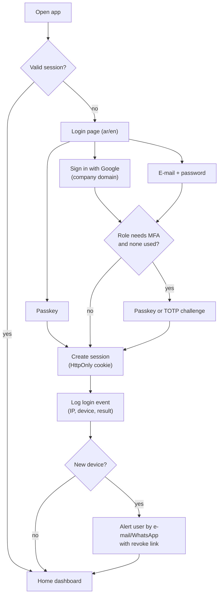

# Module 01 — Platform: Login, Users, Roles, Security & Settings (المنصة: الدخول والمستخدمون والصلاحيات والإعدادات)

| | |
|---|---|
| **Phases** | P0 → Phase 1 · P1 → Phases 2–4 · P2 → Phase 7 / SaaS stage |
| **Benchmarked** | Auth0 (Okta CIC), Microsoft Entra External ID, Google Workspace, Clerk, Supabase Auth, Keycloak 26.7, WorkOS, Better Auth; authorisation models of Salesforce, Dynamics 365/Dataverse, Odoo 19, ERPNext/Frappe, Zoho CRM; standards NIST SP 800-63B-4 (final 2025), OWASP ASVS 5.0 (May 2025), OWASP Top 10:2025 |
| **Business owner** | Owner/Admin |

## 1. Goals
1. Replace the self-typed user ID with **real identity**: company Google accounts, passkeys and MFA — same sign-in for MTQ Core and the ERPNext back office.
2. Give every user exactly the access their job needs (role × record scope × field groups × approval limits), enforced on the server and backed by database Row-Level Security.
3. Make every change traceable (append-only audit log, record history, login events).
4. Move every hard-coded constant (company names, representatives, phones, IBANs, VAT rate, payment split) into **settings**.

## 2. Login page (صفحة تسجيل الدخول)

```text
┌──────────────────────────────────────────────┐
│  [logo]  متقنون تك | Motqinon Tech     ع | EN │
│                                              │
│        تسجيل الدخول إلى منصة متقنون           │
│  ┌────────────────────────────────────────┐  │
│  │  G   المتابعة باستخدام Google            │  │  ← primary (company domain only)
│  └────────────────────────────────────────┘  │
│  ┌────────────────────────────────────────┐  │
│  │  🔑  الدخول بمفتاح المرور (Passkey)      │  │  ← fastest, phishing-resistant
│  └────────────────────────────────────────┘  │
│  ─────────────── أو ───────────────          │
│  البريد الإلكتروني  [____________________]    │
│  كلمة المرور        [____________________] 👁 │
│  [ متابعة ]                 نسيت كلمة المرور؟  │
│                                              │
│  للعملاء: الدخول برمز يُرسل إلى واتساب/البريد  │  ← portal link (passwordless)
└──────────────────────────────────────────────┘
```

**Flow**



**Rules on the page**
- Arabic by default, English toggle remembered per device; RTL layout; OTP fields accept Arabic-Indic digits (٠–٩) and normalise them.
- Generic error messages ("بيانات الدخول غير صحيحة") — never reveal whether an e-mail exists.
- Throttling with growing delays and a CAPTCHA/Turnstile challenge on risk signals; authenticator disabled after ≤ 100 consecutive failures (NIST 63B-4).
- No public sign-up: staff accounts come only from invitations.
- "Remember this device" (skip MFA up to 30 days) is **not available** to admins, finance, HR or approvers.

## 3. Feature backlog

### 3.1 Login & identity
| ID | Feature | Adopted from | P | Notes |
|----|---------|-------------|---|-------|
| PLT-01 | Google sign-in restricted to the company domain (`hd` claim + verified e-mail) | Google Workspace, all IdPs | P0 | Enforce 2-step verification on the Google side too |
| PLT-02 | Passkeys (WebAuthn) for all staff; device biometrics for technicians | Better Auth, Keycloak, Auth0, Clerk, Entra | P0 | NIST 63B-4: at least one phishing-resistant option at AAL2 |
| PLT-03 | TOTP MFA + hashed single-use recovery codes; **mandatory** for Owner/Admin/Finance/HR/approvers | All vendors | P0 | |
| PLT-04 | E-mail + password fallback: ≥ 15 chars if password-only / ≥ 8 with MFA, ≤ 64+ allowed, no composition rules, no forced rotation, paste allowed, Argon2id hashing | NIST 63B-4 | P0 | |
| PLT-05 | Breached/common-password blocking (k-anonymity HIBP range API) | NIST, Auth0, Clerk, Entra, Better Auth plugin | P0 | |
| PLT-06 | Invitation-only onboarding (signed, expiring, single-use invite with role/branch preset) | Better Auth organisation plugin, Clerk, Auth0, Keycloak | P0 | |
| PLT-07 | Safe account recovery (verified channel + second factor, no security questions, user notified) | NIST | P0 | |
| PLT-08 | Customer/partner portal: passwordless e-mail OTP / magic link (≤ 15 min, single use) or WhatsApp OTP | Better Auth, Supabase, Clerk, WorkOS | P1 | Phase 2 (quote acceptance) |
| PLT-09 | Step-up authentication before sensitive actions (large discount approval, IBAN change, role grant, bulk export) | Auth0 step-up, Entra authentication strengths, Keycloak LoA | P1 | |
| PLT-10 | SMS/WhatsApp OTP only as restricted fallback | NIST §3.1.3.3 ("restricted") | P2 | Not phishing-resistant |
| PLT-11 | Nafath identity verification (via an approved provider) for customers before contract signing | Nafath via TSP/Elm intermediaries | P2 | Needs approval; used through the e-signature provider first |
| PLT-12 | Enterprise SSO per tenant (SAML/OIDC) and SCIM provisioning | WorkOS, Keycloak, Better Auth SSO/SCIM | P2 | SaaS stage only |

### 3.2 Sessions & devices
| ID | Feature | Adopted from | P | Notes |
|----|---------|-------------|---|-------|
| PLT-20 | Server-side sessions in `HttpOnly`/`Secure`/`SameSite` cookies; nothing in `localStorage` | Better Auth, Keycloak | P0 | Today the API key lives in `localStorage` |
| PLT-21 | Re-authentication timeouts per role (default AAL2: 24 h absolute / 1 h idle; finance stricter) | NIST 63B-4 | P0 | |
| PLT-22 | Session list with device, IP, location, last activity; revoke one/all | Better Auth admin, Keycloak, Clerk, Entra | P0 | |
| PLT-23 | Global sign-out on password/MFA/role change or deactivation | Keycloak, Better Auth | P0 | |
| PLT-24 | New-device alerts with "this wasn't me" revoke link | Google, Clerk, Auth0 | P1 | |
| PLT-25 | Technician device binding (PWA install + platform passkey) | — | P1 | Phase 4 |
| PLT-26 | Support impersonation with reason/ticket, visible banner, time limit (1 h), full audit; admin impersonation needs a separate permission | Better Auth, Clerk, Salesforce "Login As" | P1 | |

### 3.3 Authorisation
| ID | Feature | Adopted from | P | Notes |
|----|---------|-------------|---|-------|
| PLT-30 | Permission catalogue `resource:action` incl. submit/approve/cancel/amend/print/export/share | ERPNext, Odoo, Dynamics privileges | P0 | |
| PLT-31 | Additive roles (permission sets); a user may hold several roles | Salesforce permission sets, Odoo groups, ERPNext roles | P0 | |
| PLT-32 | **Record scope per permission**: own · team · branch · company · all | Dynamics scopes, Odoo record rules, ERPNext user permissions | P0 | Core of the model |
| PLT-33 | Company & branch context (allowed list + active branch) stamped on records | Odoo multi-company, Dynamics business units | P0 | Makkah / Jeddah |
| PLT-34 | Field-level security by field group (cost & margin, supplier prices, national ID/iqama, IBAN, salaries) | Salesforce FLS, ERPNext perm levels, Dynamics field security | P0 | |
| PLT-35 | Approval limits per role (max discount %, quote value, PO value) with escalation chain | ERPNext authorisation rules, Dynamics, Odoo approvals | P0 | Shared with module 03/07 |
| PLT-36 | Document state gates (draft → submitted → approved → issued; issued immutable) | ERPNext docstatus, Odoo posted moves | P0 | |
| PLT-37 | Server-side enforcement + PostgreSQL RLS tenant backstop (`FORCE ROW LEVEL SECURITY`, no `BYPASSRLS`) | OWASP A01:2025, Supabase RLS pattern | P0 | UI hiding is cosmetic only |
| PLT-38 | Manager hierarchy (managers see their team's records) | Salesforce role hierarchy, Dynamics hierarchy security | P1 | |
| PLT-39 | Separation of duties (creator ≠ approver; payment creator ≠ poster) | ERP audit practice | P1 | |
| PLT-40 | Manual and rule-based record sharing | Salesforce, ERPNext Share, Dynamics | P1 | |
| PLT-41 | Territories (Makkah, Jeddah, Riyadh) | Zoho, Salesforce | P2 | |
| PLT-42 | "Why can I see this?" effective-access explainer | Salesforce, Dynamics "Check access" | P2 | |

### 3.4 Audit & governance
| ID | Feature | Adopted from | P | Notes |
|----|---------|-------------|---|-------|
| PLT-50 | Append-only, hash-chained audit log (actor, impersonator, tenant, action, record, before/after, IP, UA, reason); insert-only DB role; daily export to WORM storage | WorkOS Audit Logs, Salesforce Setup Audit Trail, Dynamics auditing | P0 | |
| PLT-51 | Field history on key records (price, qty, discount, status, owner, VAT/unified number) | Salesforce field history, Odoo tracking, ERPNext Version | P0 | |
| PLT-52 | Login & admin event log (logins, failures, MFA/passkey changes, role grants, impersonation) | Keycloak events, Entra sign-in logs | P0 | |
| PLT-53 | Document revisions & issued-document archive (PDF + SHA-256) | ERPNext amend, Salesforce quote versions | P0 | Today files are overwritten |
| PLT-54 | Soft delete & restore for master data; purge after retention | Odoo archiving, Salesforce Recycle Bin | P1 | Issued documents are never deleted |
| PLT-55 | Controlled, logged, watermarked exports (also used for PDPL access requests); alert on large exports | Salesforce, Odoo, ERPNext | P1 | |
| PLT-56 | Retention rules & legal hold | Salesforce Shield, Dynamics | P1 | Tax records ≥ 6 years (10 as safe default) |
| PLT-57 | PDPL registers: processing activities, consents, data-subject requests, breach log (72-hour clock) | PDPL | P1 | |

### 3.5 Admin console & user lifecycle
| ID | Feature | Adopted from | P | Notes |
|----|---------|-------------|---|-------|
| PLT-60 | Invite / deactivate (never delete) / reassign records / revoke sessions & keys | All | P0 | Google SSO alone does not end existing sessions |
| PLT-61 | Role templates (see §4) and a roles × permissions × scope matrix with diff before save | Dynamics, ERPNext Role Permission Manager | P0 template · P1 matrix | |
| PLT-62 | Provision back-office (ERPNext) users for finance/store/HR roles from Core | — | P0 | Same Google identity |
| PLT-63 | API keys & service accounts (scoped, expiring, rotated) for integrations and IoT gateways | Better Auth, WorkOS, Keycloak | P1 | |
| PLT-64 | Break-glass admin (hardware key, alert on use) | Industry practice | P1 | |
| PLT-65 | Security dashboard (MFA/passkey adoption, last login, risky users) and quarterly access reviews | Clerk, Entra | P2 | |

### 3.6 Company settings & configuration
| ID | Feature | Adopted from | P | Notes |
|----|---------|-------------|---|-------|
| PLT-70 | Company profile: legal names ar/en, unified number, VAT number, national address, logo, stamp, phones, bank accounts (IBAN), signatory/representative | Odoo, ERPNext company settings | P0 | Removes hard-coded contract data |
| PLT-71 | Branches (Makkah HQ, Jeddah) with addresses and default warehouse / EGS unit | Odoo, ERPNext | P0 | |
| PLT-72 | Numbering series editor (patterns, next value, reset rules) | ERPNext naming series | P0 | Legacy formats preserved |
| PLT-73 | Document templates (quote, contract, payment request, service report, handover) per language with versioning | Odoo QWeb, Zoho templates | P0 | |
| PLT-74 | Company calendar: Sun–Thu, holidays, Ramadan hours, midday outdoor-work ban window, prayer-time soft blocks | Odoo resource calendars (+ KSA rules) | P0 | Drives SLAs and delivery clocks |
| PLT-75 | Custom fields per entity (admin-defined) | Odoo Studio, Salesforce, Zoho | P1 | |
| PLT-76 | Automation & approval rule editor | Zoho Blueprint, Salesforce Flow, Odoo automation rules | P1 | Shared engine |
| PLT-77 | In-app notification centre + web push (installed PWA on iOS 16.4+) | All | P1 | |

### 3.7 Multi-tenancy (SaaS-ready)
| ID | Feature | P | Notes |
|----|---------|---|-------|
| PLT-80 | `tenant_id` on every row + RLS; tenant set per transaction with `set_config('app.tenant_id', …, true)` | P0 (design) | Works behind PgBouncer transaction pooling |
| PLT-81 | Tenant-aware numbering, file paths, caches, queues, logs | P0 | |
| PLT-82 | Tenant lifecycle (create/suspend/export/delete), per-tenant branding & limits | P2 | Only if SaaS is confirmed (D3) |

## 4. Default roles & sample permissions

| Role | Quotes | Contracts | Projects / WOs | Finance | HR | Admin |
|------|--------|-----------|----------------|---------|----|-------|
| Owner/Admin | all | all | all | all | all | ✔ |
| General Manager | all + approve | all + sign | all | read all | read summary | — |
| Sales Manager | team + approve ≤ limits | team | read team | read AR of team | — | — |
| Sales Rep | own (no cost/margin) | own draft | read own customers | read own invoices | — | — |
| Pre-sales Engineer | assigned (with cost) | read | surveys | — | — | — |
| Project Manager | read | read | own projects + approve snags | read project P&L | — | — |
| Site Supervisor / Technician | — | — | assigned WOs (PWA) | — | own attendance | — |
| Storekeeper / Purchaser | read | read | material requests | stock & POs (ERPNext) | — | — |
| Accountant / Finance Manager | read | read | read | ERPNext finance roles | payroll (FM) | — |
| HR Officer | — | — | — | — | all HR (ERPNext) | — |
| Customer Service | read | read | tickets + WOs | read balances | — | — |
| Auditor | read all | read all | read all | read all | — | — |

## 5. Security baseline (from the audit of today's tool)
Phase 0 closes the critical findings (public Drive folders, unauthenticated save endpoint, typed admin ID, stored XSS); the new platform never exposes storage directly to browsers, escapes all output by default, keeps secrets in Secret Manager/KMS, and runs OWASP ASVS 5.0 L2 checks — see [03-target-architecture.md §12](../03-target-architecture.md#12-security-architecture).

## 6. Acceptance criteria (Phase 1 exit)
- Every user signs in with Google or a passkey; privileged roles cannot complete sign-in without a passkey/TOTP.
- A sales rep cannot read another rep's quote or any cost/margin field through the UI **or** the API (automated tests).
- Every create/update/approve/issue action appears in the audit log with before/after values.
- Company data on generated documents comes only from settings; changing the IBAN requires step-up authentication and is audited.
- Sessions can be listed and revoked; deactivating a user ends their sessions immediately.
