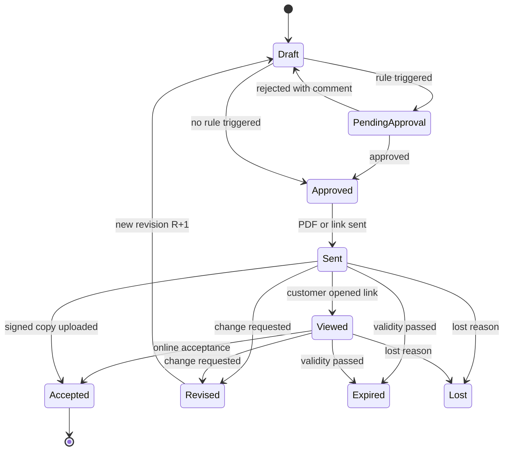

# Module 03 — Quotations & CPQ (عروض الأسعار والتسعير)

| | |
|---|---|
| **Phases** | P0 → Phase 1 · P1 → Phase 2 · P2 → Phase 7 |
| **Benchmarked** | D-Tools Cloud & SI, Portal.io, Jetbuilt, simPRO, ServiceTitan Pricebook Pro, Salesforce Agentforce Revenue Management, HubSpot CPQ, Zoho CRM CPQ, PandaDoc, Proposify, Qwilr, DealHub |
| **Business owner** | Sales Manager |
| **Legend** | ✅ = already in today's `index.html` (must keep) |

## 1. Goals
1. Keep today's speed: a rep builds a 20-line bilingual quote in ≤ 3 minutes.
2. Add control: statuses, revisions, approvals, margin visibility and an archive of exactly what was sent.
3. Add conversion: online acceptance, one click to contract, project, purchase orders and invoices.
4. Differentiate: integrator-grade CPQ (packages, alternatives, labor, capacity rules, BOQ import, AI drafting).

## 2. Feature backlog

### 2.1 Catalog & pricebook
| ID | Feature | Adopted from | P | Notes |
|----|---------|-------------|---|-------|
| CPQ-01 | Product master (code, brand, model, category, bilingual name/description, images, specs, status, replacement) | D-Tools, Portal.io, Salesforce | P0 | ✅ sheet catalog → database; import once |
| CPQ-02 | Supplier cost, margin & markup shown live (internal only) | D-Tools | P0 | Hidden from customer documents and from roles without `quote.view_cost` |
| CPQ-03 | Datasheets / spec PDFs per product | ServiceTitan, D-Tools SI | P1 | Reused for consultant submittals |
| CPQ-04 | Typed technical attributes (PoE watts, ports, power draw, I/O) | Salesforce, D-Tools | P1 | Needed for capacity rules |
| CPQ-05 | Price lists per segment (retail, contractor, developer, government) and quantity tiers | Salesforce, HubSpot, Zoho | P1 | |
| CPQ-06 | Supplier price-list import (Excel) with FX conversion and cost-driven re-pricing | ServiceTitan (dynamic pricing), Portal.io | P1 | USD/CNY → SAR |
| CPQ-07 | Recurring service items (AMC, monitoring subscriptions) shown separately | Portal.io, Qwilr, DealHub | P1 | Upsell AMC at quote time |
| CPQ-08 | Allowance lines (budget placeholders for undefined scope) | D-Tools | P2 | |

### 2.2 Building the quote
| ID | Feature | Adopted from | P | Notes |
|----|---------|-------------|---|-------|
| CPQ-10 | Catalog panel with search, favourites, recent items, brand/category facets | D-Tools, Portal.io | P0 | ✅ search; add facets |
| CPQ-11 | Lines: qty, editable unit price with struck-through list price, **FREE** at 0, editable description with "modified" flag, drag-and-drop order, delete | — | P0 | ✅ all present today |
| CPQ-12 | Per-line discount % | HubSpot | P0 | New |
| CPQ-13 | Sections by area/system (Gate, Ground floor, Apt 1, Villa 3…) with subtotals | D-Tools (rooms), Portal.io (areas), Jetbuilt | P0 | |
| CPQ-14 | Packages / kits (one line that expands or rolls up components) | D-Tools, simPRO prebuilds, PandaDoc bundles | P0 | "Villa intercom package" |
| CPQ-15 | Optional lines (priced, excluded from total until chosen) | Proposify, Qwilr, Portal.io | P0 | |
| CPQ-16 | Alternatives / Good-Better-Best sets (e.g., 2-wire vs IP vs IP + face recognition) | D-Tools alternate sets, ServiceTitan, Qwilr | P1 | |
| CPQ-17 | Accessory auto-add (outdoor unit → back box + rain hood; lock → bracket + PSU) | D-Tools, D-Tools SI | P1 | |
| CPQ-18 | Capacity checks: PoE budget, switch ports, PSU amps vs device count | Salesforce Constraint Builder (generic) | P1 | Integrator differentiator |
| CPQ-19 | Compatibility rules (requires / excludes / recommends) | Salesforce, Zoho configurator, PandaDoc rulesets | P2 | Start with a simple rule table |
| CPQ-20 | Guided selling questionnaire (floors, apartments, gates → draft BOM) | DealHub playbooks, Salesforce | P2 | |
| CPQ-21 | Duplicate quote / copy lines from another quote | All | P0 | |

### 2.3 Labor & installation
| ID | Feature | Adopted from | P | Notes |
|----|---------|-------------|---|-------|
| CPQ-30 | Auto installation line **INS** = Σ(install cost × qty), always last, overridable, deletable, manual add | D-Tools (labor attached to items) | P0 | ✅ exact current behaviour |
| CPQ-31 | Labor types (installation, cabling, programming, commissioning) × hours × rate, rolled into INS or shown separately | D-Tools, Jetbuilt | P1 | Keeps a single INS line on the PDF as an option |
| CPQ-32 | Crew-days breakdown (hours → days by crew size) feeding project scheduling | Jetbuilt | P2 | |

### 2.4 Pricing, discounts, tax & approvals
| ID | Feature | Adopted from | P | Notes |
|----|---------|-------------|---|-------|
| CPQ-40 | Header discount as % or fixed amount (mutually exclusive) | All | P0 | ✅ |
| CPQ-41 | Tax per line (15% standard, zero-rated, exempt) with VAT toggle for exempt customers | HubSpot | P0 | ✅ VAT toggle; add tax codes |
| CPQ-42 | Discount approval thresholds (header %, line price below list, FREE lines) | PandaDoc, HubSpot, Proposify, DealHub, Salesforce | P0 | Blocks PDF/sending until approved |
| CPQ-43 | Margin guardrails (minimum margin per category / per quote) | D-Tools margin view, Salesforce, DealHub | P0 | Below minimum → approval |
| CPQ-44 | Multi-level & parallel approvals, recall, delegation, approve from mobile/WhatsApp | DealHub, Salesforce Flow Approval Orchestration | P1 | |
| CPQ-45 | Payment schedule shown on the quote (default 50/40/10) | Portal.io | P0 | ✅ exists in contracts; show on quotes |
| CPQ-46 | Automatic price rules by customer/quantity | Zoho, PandaDoc | P2 | |

### 2.5 Lifecycle, documents & templates
| ID | Feature | Adopted from | P | Notes |
|----|---------|-------------|---|-------|
| CPQ-50 | Numbering `Q-YYYY-{userCode}{seq}` + revision suffix `-R1…` | — | P0 | ✅ number format kept; server-side sequence |
| CPQ-51 | Status pipeline Draft → Pending approval → Approved → Sent → Viewed → Accepted / Lost / Expired | HubSpot, Salesforce, Jetbuilt, D-Tools | P0 | Lost reason mandatory |
| CPQ-52 | Revisions locked once sent; new revision on change; history kept | Jetbuilt, DealHub | P0 | Replaces JSON overwrite |
| CPQ-53 | Version compare (lines, prices, totals) | DealHub, Portal.io "Highlight Changes" | P1 | |
| CPQ-54 | Validity date, auto-expiry, reminders (D-3, D-0) | HubSpot, PandaDoc | P0 expiry · P1 reminders | Default 10 days (today's terms) |
| CPQ-55 | Quote templates by job type (villa, building, smart home, access control) with default lines, notes and terms | D-Tools, Proposify, PandaDoc, HubSpot | P0 | |
| CPQ-56 | Content library (scope, technical notes, terms blocks) | Proposify, PandaDoc | P1 | ✅ partial (two text blocks today) |
| CPQ-57 | Conditional content (e.g., face-recognition items → PDPL consent clause) | PandaDoc smart content | P2 | |
| CPQ-58 | Bilingual Arabic-first PDF (A4, repeating headers, page x of y, footer), tafqit | Zoho, Signit | P0 | ✅ print design reused server-side |
| CPQ-59 | Excel export with images; CSV export of lists | — | P0 | ✅ ExcelJS export kept |
| CPQ-60 | Immutable archive of every issued PDF (hash, version, sender, time) | Odoo Documents, DocuSign | P0 | Evidence in disputes |
| CPQ-61 | Send by WhatsApp (utility template + PDF) and e-mail from the quote | Odoo, Zoho, Portal.io | P0 | Logged on the timeline |

### 2.6 Interactive proposal & acceptance
| ID | Feature | Adopted from | P | Notes |
|----|---------|-------------|---|-------|
| CPQ-70 | Web proposal link (mobile, Arabic RTL) instead of only a PDF | Qwilr, Portal.io, D-Tools, Proposify, DealHub | P1 | |
| CPQ-71 | Customer selects options/alternatives; totals update live | Qwilr, Proposify, D-Tools, Portal.io | P1 | |
| CPQ-72 | Customer comments/questions on the proposal | D-Tools customer portal, DealHub | P1 | |
| CPQ-73 | View tracking & alerts (opened, time on sections, forwarded) | Qwilr, Proposify, D-Tools | P1 | Triggers follow-up tasks |
| CPQ-74 | Online acceptance with OTP (WhatsApp/SMS), typed/drawn signature, IP + time + PDF hash | PandaDoc, Portal.io, D-Tools, Qwilr | P1 | Enough for quotes; contracts use Nafath (module 04) |
| CPQ-75 | Deposit payment at acceptance (mada / Apple Pay link) | PandaDoc, Qwilr, Portal.io, D-Tools Payments | P2 | Needs the advance-payment tax invoice (module 08) |
| CPQ-76 | AI buyer assistant answering questions inside the proposal | HubSpot Closing Agent | P2 | |

### 2.7 Conversion
| ID | Feature | Adopted from | P | Notes |
|----|---------|-------------|---|-------|
| CPQ-80 | Accepted quote → contract (module 04) | DealHub, Salesforce | P0 | ✅ contract generation exists |
| CPQ-81 | Accepted quote → supply-only sales order | Odoo, Salesforce | P1 | For walk-in / supply-only sales |
| CPQ-82 | Accepted quote → project with BOQ baseline and budget (module 05) | Jetbuilt, D-Tools, Odoo | P1 | Phase 4 |
| CPQ-83 | Accepted quote → purchase requests grouped by supplier (module 07) | Portal.io one-click POs, Jetbuilt | P1 | Phase 5 |
| CPQ-84 | Change orders from a signed quote/contract (client-facing or internal) | Portal.io, D-Tools, Jetbuilt | P1 | See module 04 |

### 2.8 BOQ, design & AI
| ID | Feature | Adopted from | P | Notes |
|----|---------|-------------|---|-------|
| CPQ-90 | Consultant BOQ Excel import (column mapping, match rows to catalog, keep BOQ item refs) and export priced BOQ in the **same layout** | simPRO import schedules | P1 | Critical for buildings/compounds in KSA |
| CPQ-91 | Compliance/deviation column per line and a deviation list | (KSA practice) | P1 | |
| CPQ-92 | Submittal pack generator (datasheets + compliance statement + BOQ) | (KSA practice) | P1 | Feeds consultant approvals (module 05) |
| CPQ-93 | AI BOQ/PDF/photo → draft quote with confidence scores, human review | D-Tools Quote Assist (Sep 2026), Portal.io AI Proposal Builder, Jetbot | P2 | Flagship AI feature (module 12) |
| CPQ-94 | Plan-based design, riser/line diagrams generated from the BOM | D-Tools SI & Cloud, Jetbuilt | P2 | Integrate/buy rather than build |
| CPQ-95 | Pricing insights (discount leakage, win-rate by price band) | ServiceTitan Price Insights, Salesforce | P2 | |

## 3. Quote lifecycle

## 4. Business rules
1. **Totals** follow today's rules exactly ([01-current-state.md §2](../01-current-state.md#business-rules-embedded-in-the-code-carry-over-exactly)), plus line discounts; amounts computed with decimals and rounded to 2 places per line; the header discount is allocated to lines pro-rata for tax so quote totals equal the future invoice totals.
2. **Default approval matrix** (configurable): header discount > 10%, any line more than 15% below list, any non-labor FREE line, quote margin < 20% or total > SAR 250k → Sales Manager; margin < 10% or total > SAR 1M → General Manager.
3. **Locking:** once sent, a revision is read-only; edits create `R+1`; only the latest revision can be accepted.
4. **Validity:** default 10 days; expired quotes cannot be accepted until re-validated by a new revision.
5. **B2B data completeness:** CR/unified number, VAT number (15 digits, starts and ends with 3) and national address are warned at quote stage and **required** before contract/invoice.
6. **Cost privacy:** cost, margin and supplier fields are never rendered in customer documents and are filtered from API responses for roles without permission.
7. **Win-rate counting:** all revisions of one opportunity count once; quotes > 30 days past validity count as lost.

## 5. Screens
| Screen | Key elements |
|--------|-------------|
| Quote list | Saved views (Mine, Pending approval, Expiring ≤ 7 days, Won this month), filters, columns (no., rev, customer, project, rep, date, valid until, total, margin* , status), export |
| Quote editor | Catalog panel (search, facets, packages) · document (customer/site/contact pickers, sections, lines, INS, totals, discount, VAT, payment schedule, notes/terms library) · side drawer (cost & margin*, approvals, versions, activity timeline, attachments) |
| Preview & send | PDF preview ar/en, WhatsApp/e-mail send dialog with template, share link, download Excel |
| Approval inbox | Pending items with reason (which rule), diff vs previous revision, approve/reject with comment — mobile friendly |
| Version compare | Side-by-side R(n-1) vs R(n): added/removed/changed lines and totals |
| Public proposal page | RTL mobile page: options, comments, accept with OTP, download PDF |
| Catalog admin | Products, packages, labor types, price lists, attributes, import/export |
| BOQ import wizard | Upload → map columns → match (fuzzy/AI) → review → create quote → export priced BOQ |

\* visible only with `quote.view_cost`.

## 6. Reports (see [module 10](10-reports-bi.md))
Q1 Quote register · Q2 Win rate · Q3 Discount analysis · Q4 Quote margin · Q5 Expiring & aging quotes · Q6 Turnaround · Q7 Top quoted items · Q8 Lost-quote price gap · Q9 Quote→order leakage.

## 7. Acceptance criteria (Phase 1 exit)
- Recomputing every migrated legacy quote with the new engine reproduces its stored grand total (differences listed and explained).
- A 20-line quote with INS, one FREE line and a % discount takes ≤ 3 minutes for a trained rep.
- PDF output matches the approved Arabic and English designs (visual regression tests), including multi-page tables and footer.
- Sending is blocked while an approval is pending; approval decisions appear in the audit log and timeline.
- Every sent revision has an archived PDF with SHA-256 hash; old revisions are read-only.
