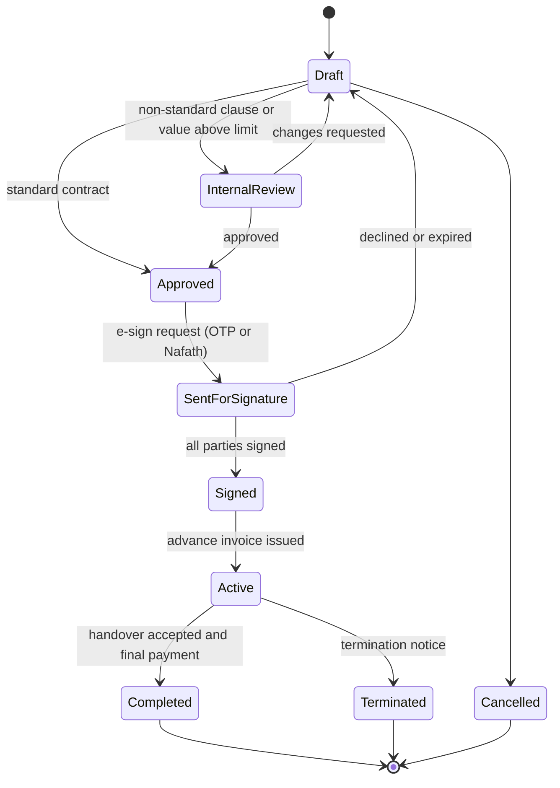

# Module 04 — Contracts, E-signature & Change Orders (العقود والتوقيع الإلكتروني)

| | |
|---|---|
| **Phases** | P0 → Phase 1 · P1 → Phase 2 · P2 → Phase 7 |
| **Benchmarked** | Zoho Contracts + Zoho Sign, DocuSign IAM (Navigator, Maestro, Iris agents), DealHub, Signit (KSA), emdha, Sadq, PandaDoc, Portal.io & D-Tools change orders |
| **Business owner** | General Manager (signatory) with Sales Manager |
| **Legend** | ✅ = already in today's `index.html` |

## 1. Goals
1. Generate a legally sound bilingual contract from an accepted quote in minutes, with data pulled from the customer master and company settings (no hard-coded names, phones or IBANs).
2. Sign electronically with a method that stands up in Saudi courts (Nafath-verified via a licensed trust service provider for B2B).
3. Turn the signed contract into **billing milestones**, a **project**, and tracked **obligations** (delivery clock, warranty, spare parts, renewals).

## 2. Feature backlog

| ID | Feature | Adopted from | P | Notes |
|----|---------|-------------|---|-------|
| CON-01 | Generate contract from accepted quote revision (parties, items, totals, VAT, notes) | DealHub, Salesforce | P0 | ✅ `openContract()` today |
| CON-02 | Contract templates by type: supply only · supply & install · smart home · AMC/maintenance | Zoho Contracts, Signit | P0 | ✅ one template today |
| CON-03 | Party data from masters: customer legal name, **unified national number (700…)** and legacy CR, VAT no., national address, authorised signatory; supplier data and representative from company settings | Zoho, Signit | P0 | Fixes today's hard-coded/drifting second-party data |
| CON-04 | Payment-schedule builder (any number of milestones; % or amount; trigger: on signing / before delivery / after programming / on handover / date) — default 50/40/10 | Portal.io, Odoo milestones | P0 | ✅ fixed 50/40/10 today |
| CON-05 | Amounts in Arabic words (tafqit) + English words, riyal/halala | Local libraries | P0 | ✅ `tafqit()` ported with unit tests |
| CON-06 | Bank details (IBAN) from company settings, selectable per contract | — | P0 | ✅ hard-coded today |
| CON-07 | Numbering `MTQCT-{seq}` (server-side series) | — | P0 | ✅ serial in localStorage today |
| CON-08 | Status workflow Draft → Internal review → Approved → Sent for signature → Signed → Active → Completed / Terminated / Cancelled | Zoho, Signit, DealHub | P0 | |
| CON-09 | Editable articles with "modified from template" tracking | Zoho, Signit | P0 | ✅ contenteditable today (untracked) |
| CON-10 | Immutable signed PDF archive + hash; issued-document register | Signit, emdha, DocuSign | P0 | |
| CON-11 | Clause library (approved Arabic/English clauses, categories, versions, picker) | Zoho Contracts, Signit | P1 | Warranty, spare parts, jurisdiction, PDPL, fire-alarm fail-safe, "Arabic text prevails" |
| CON-12 | Internal approval before sending (legal/finance review for non-standard clauses or values) | Zoho, Signit, DealHub | P1 | |
| CON-13 | **E-signature — tier 1:** OTP-verified click/draw signature with audit trail (for B2C and low-value) | PandaDoc, Portal.io | P1 | Same component as quote acceptance |
| CON-14 | **E-signature — tier 2:** Nafath-verified signature through a DGA-licensed TSP (Signit / emdha / Sadq) with provider transaction ID | Signit, emdha, Sadq, Zoho Sign (KSA DC) | P1 | Decision D8 in the roadmap |
| CON-15 | Electronic company seal (replaces the scanned stamp image) | Signit | P2 | |
| CON-16 | Contract repository: metadata, full-text search, filters (customer, value, status, expiry) | DocuSign Navigator, Signit, Zoho | P1 | |
| CON-17 | **Obligations & reminders:** advance due, approvals pending, delivery window (45–60 working days), pre-delivery payment, programming payment, handover, warranty end, spare-parts horizon, AMC renewal, retention release | Zoho, DocuSign, Signit | P1 | Feeds project stage gates (module 05) |
| CON-18 | **Change orders / variations:** lines added/removed/changed, price and **days impact**, client-facing or internal, approval + signature, running contract value | Portal.io ("Highlight Changes"), D-Tools, Jetbuilt, Procore | P1 | Extends the delivery clock when approved |
| CON-19 | Redlining & negotiation with version compare | Zoho, DealHub, Signit | P2 | Consultant/client markups |
| CON-20 | Upload third-party (client-issued) contracts and extract key terms with AI | DocuSign Navigator/Iris | P2 | Module 12 |
| CON-21 | Contract → billing milestones → invoices (module 08) | Odoo, Salesforce | P0 (data) · Phase 3 (invoicing) | Milestones stored in Phase 1 |
| CON-22 | Contract → project from template (module 05) | Odoo, D-Tools | Phase 4 | |
| CON-23 | AMC / service contracts with coverage, visits and recurring billing (module 06) | D365 agreements, ServiceTitan memberships | P1 (Phase 7b) | |

## 3. Contract lifecycle

## 4. Standard clause set (from today's contract, made configurable)
| # | Article (ar) | Content | Parameters |
|---|-------------|---------|-----------|
| 1 | مرفقات العقد | Preamble, BOQ, prices and approved specs are part of the contract | — |
| 2 | المواصفات الفنية والأسعار | Item table, fixed prices, changes only in writing | Items, totals |
| 3 | نطاق الأعمال | Supply and installation per approved specs & BOQ | Scope type |
| 4 | الدفعات وآلية السداد | Milestones with amounts in numbers and words, bank account | Schedule, IBAN |
| 5 | مدة التوريد والتركيب والبرمجة | 45–60 working days from the later of advance receipt and written approval of specs, door directions, room numbers and design | Min/max days, gate conditions |
| 6 | الاختصاص القضائي | KSA law; competent Saudi courts | — |
| 7 | الضمان والصيانة | 2-year warranty from installation & operation; exclusions; 10-year spare parts | Months, years |
| 8 | نسخ العقد | Two originals (or electronic original when e-signed) | Signing method |
| New | لغة العقد | Arabic text prevails over English | — |
| New | حماية البيانات الشخصية | Face-recognition / resident data processing and consent (PDPL) — **legal review required** | Applies when biometric devices are quoted |
| New | متطلبات السلامة | Electric locks release on fire alarm / power loss with manual release (SBC 801 practice) — **legal/technical review required** | Applies when maglocks are quoted |

## 5. Business rules
1. A contract can only be created from the **latest accepted revision**; its lines, prices and totals are copied (snapshots) and the quote becomes read-only.
2. Milestone percentages must total 100% of the VAT-inclusive contract value; amounts are rounded so that the last milestone absorbs the rounding difference.
3. B2B contracts require customer unified number/CR, VAT number, national address and signatory before *Approved*.
4. Signed contracts are immutable; every later change is a **change order** that references the contract, updates the running value and (if approved) extends the delivery window by its `days impact`.
5. The **delivery clock** starts at the later of: advance payment received (module 08) and client approvals signed (module 05); working days exclude Fri–Sat and public holidays (company calendar).
6. The advance (50%) is invoiced as an **advance-payment tax invoice** on receipt, and later milestone invoices deduct it per ZATCA rules (module 08).

## 6. Screens
Contract list & repository · Contract editor (parties, clause picker, milestones builder, preview) · Signature tracker (who signed, when, method) · Obligations calendar · Change-order editor with highlighted differences · Contract detail (timeline, documents, milestones, invoices, project link).

## 7. Acceptance criteria (Phase 1 exit)
- A contract generated from a migrated quote reproduces today's layout and amounts (including tafqit) exactly.
- Company data (names, representative, phones, IBAN, stamp) comes only from settings.
- Milestones stored as data (not text) and visible on the contract page.
- Signed/issued contract PDFs are archived with hash and cannot be edited.
