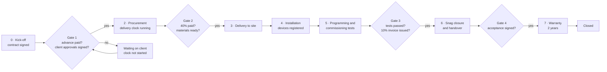

# Module 05 — Projects & Execution Tracking (إدارة المشاريع ومتابعة التنفيذ)

| | |
|---|---|
| **Phases** | P0 → Phase 4 · P1 → Phase 4 (late) / Phase 7 · P2 → later |
| **Benchmarked** | Procore, monday.com, Asana, ClickUp, Microsoft Planner Premium / Project, Smartsheet, Odoo Project + Timesheets, Zoho Projects, D-Tools Cloud, simPRO, Jetbuilt |
| **Business owner** | Projects Manager |

## 1. Goals
1. Every signed contract becomes a tracked project with a clear stage, owner, next step and date.
2. Encode Motqinon's contract logic: **stage gates** (advance paid, client approvals signed, 40% before delivery, 10% after programming) and the **45–60 working-day delivery clock**.
3. Give evidence and control: approvals, surveys, photos, test sheets, snag list, handover and warranty start — all on one record.
4. Show money per project: billing milestones, costs, margin, change orders.

## 2. Project flow & stage gates

**Delivery clock:** starts at the *later* of (a) advance received and (b) written client approval of specs, door directions, room numbers and design; counts **working days** on the company calendar (Sun–Thu, public holidays and Eid excluded); target window 45–60 days; warnings at 70% and 90% of the window; approved change orders and documented client/consultant delays extend it; every pause is logged as evidence.

## 3. Feature backlog

### 3.1 Initiation & structure
| ID | Feature | Adopted from | P | Notes |
|----|---------|-------------|---|-------|
| PRJ-01 | Create project from signed contract / accepted quote with BOQ, milestones and budget baseline | Odoo v19, D-Tools, simPRO, ServiceTitan | P0 | |
| PRJ-02 | Project templates by type: villa intercom · building intercom · smart home · smart locks · LoRaWAN/IoT | Odoo task templates, Smartsheet Control Center, monday, Asana | P0 | Phases, tasks, checklists, roles, durations |
| PRJ-03 | Stages with **gates** that block progress until criteria are met (§2) | Zoho Blueprint pattern, Odoo/monday automations | P0 | Gate status visible on the project header |
| PRJ-04 | **Contractual delivery clock** in working days with warnings and pause log | Not native anywhere — build | P0 | Company calendar from module 01 |
| PRJ-05 | Health (RAG), % complete, overdue items, cash position per project | Asana, Smartsheet, monday, Planner | P1 | |
| PRJ-06 | Portfolio view across projects (by stage, PM, city, customer) | Asana portfolios, Smartsheet, monday | P1 | Makkah vs Jeddah crews |

### 3.2 Planning & views
| ID | Feature | Adopted from | P | Notes |
|----|---------|-------------|---|-------|
| PRJ-10 | Tasks / subtasks / checklists; tasks generated per building → floor → unit from the site location tree | All | P0 | |
| PRJ-11 | Milestones (approvals, delivery, installation, programming, handover) | All; Odoo ties them to invoicing | P0 | |
| PRJ-12 | Kanban (by stage), list and calendar views | All | P0 | |
| PRJ-13 | Dependencies (FS/SS/FF + lag) with automatic rescheduling | Planner Premium, Smartsheet, ClickUp, monday, Zoho Projects | P1 | Cabling → mounting → programming |
| PRJ-14 | Gantt / timeline (RTL-capable component) | Planner, Smartsheet, monday, ClickUp, Odoo, D-Tools | P1 | A simple timeline is enough for the first release |
| PRJ-15 | Baselines and critical path | MS Project, Smartsheet | P2 | Useful for towers only |
| PRJ-16 | Workload/capacity per technician and team (installers vs programmers) | monday, Asana, Smartsheet, ClickUp, Odoo Planning | P1 | Shares resources with module 06 |
| PRJ-17 | Automation rules ("approvals signed" → material request; "snags closed" → final invoice draft) | monday, Asana, ClickUp, Odoo | P1 | Workflow engine (module 01) |

### 3.3 Client approvals, surveys & site documentation
| ID | Feature | Adopted from | P | Notes |
|----|---------|-------------|---|-------|
| PRJ-20 | **Client approval packages** (specs, door directions, room numbering, design) — versioned, e-signed, lock the spec | D-Tools approvals, Odoo Sign, Procore submittals | P0 | Starts the delivery clock |
| PRJ-21 | Site-survey digital forms per door/unit (door hand, lock type, cable route, monitor & PoE/rack positions, measurements, photos) | Odoo worksheets, simPRO forms, D365 inspections | P0 | Can start at opportunity stage |
| PRJ-22 | Photos/videos with GPS, time and markup attached to tasks, units and devices | Procore, ServiceTitan, Jobber, Odoo | P0 | Before/after at every door |
| PRJ-23 | Commissioning test sheets per device (call, video, unlock, face enrolment, fire-alarm release) | simPRO test readings, Procore inspections, D365 | P0 | Gate 3 |
| PRJ-24 | Punch / snag list (location, photo, assignee, due, verification) | Procore punch list | P0 | Gate 4 |
| PRJ-25 | Consultant **submittal / material approval (MAR) register** with status codes A/B/C/D and revisions | Procore submittals (AI-checked) | P1 | Consultant delays shift the clock |
| PRJ-26 | Daily site log (manpower, work done, delays, photos) — AI-drafted later | Procore Daily Log, ServiceTitan Atlas | P1 | |
| PRJ-27 | Drawings & documents with versions and markup (riser diagrams, IP plans, as-builts) | Procore Drawings, D-Tools interconnect diagrams | P1 | |
| PRJ-28 | RFIs, inspection requests (IR/WIR), site instructions log | Procore RFIs & inspections | P2 | P1 for consultant-led buildings |

### 3.4 Handover & warranty
| ID | Feature | Adopted from | P | Notes |
|----|---------|-------------|---|-------|
| PRJ-30 | **Handover package generator**: bilingual PDF with device schedule (per unit: model, serial, MAC, IP, firmware), as-builts, manuals, warranty terms, training attendance, acceptance certificate | No benchmark does it end-to-end (Procore closeout, D-Tools diagrams partially) | P0 | **Differentiator** |
| PRJ-31 | Credentials vault (encrypted, role-gated reveal with audit; never printed in the handover PDF; rotation at handover) | Gap in all benchmarked FSMs | P1 | Security differentiator |
| PRJ-32 | Training & acceptance sign-off; acceptance date = warranty start | Odoo Sign; SF/D365/Jobber signatures | P0 | |
| PRJ-33 | Automatic warranty records per installed device (installation warranty vs manufacturer warranty) | simPRO, Zoho FSM, D365, D-Tools | P0 | Module 06 installed base |

### 3.5 Project financials
| ID | Feature | Adopted from | P | Notes |
|----|---------|-------------|---|-------|
| PRJ-40 | Billing milestones tied to gates (50/40/10): payment requests and 386/388 invoice requests created automatically (module 08) | Odoo milestone invoicing, Procore owner invoices, D-Tools deposits | P0 | Delivery blocked until the 40% is paid (configurable) |
| PRJ-41 | Change orders / variations (scope + price + days), client-signed (module 04) | Procore, D-Tools, simPRO, ServiceTitan Atlas | P0 | |
| PRJ-42 | Timesheet capture per task/work order | Odoo, ClickUp, Zoho Projects, D-Tools, ServiceTitan | P0 capture · P1 costing | |
| PRJ-43 | Budget by cost type (materials, labor, subcontract, expenses) seeded from the quote costs | Procore, simPRO, D-Tools, Odoo analytic | P1 | |
| PRJ-44 | Budget vs actual + estimate at completion; committed cost from open POs | Procore, simPRO, D-Tools, Odoo | P1 | Needs modules 07/08 |
| PRJ-45 | Project P&L and WIP (earned vs billed) | Procore, simPRO, Jetbuilt | P2 | Phase 6 accounting |
| PRJ-46 | Project purchasing link (material requests, POs, receipts tagged to the project) | Procore commitments, simPRO, Odoo | P1 | Phase 5 |

### 3.6 Collaboration & AI
| ID | Feature | Adopted from | P | Notes |
|----|---------|-------------|---|-------|
| PRJ-50 | Client status updates by WhatsApp (weekly summary, milestone reached, approval needed) | Jobber Client Hub, simPRO portal | P1 | Tokenised links first, full portal in Phase 7 |
| PRJ-51 | Client portal: progress, approvals, documents, invoices, devices | simPRO, Jobber, D-Tools | P1 | Module 11 |
| PRJ-52 | "Project watchdog" agent: flags approvals past SLA, unpaid milestones, aging snags, clock at risk | Smartsheet PM agent, Planner Project Manager agent, monday agents | P2 | Module 12 |
| PRJ-53 | AI drafting of daily logs and submittal checks against the approved BOQ/spec | Procore Helix, ServiceTitan Atlas | P2 | Human approves every output |

## 4. Saudi operating rules built into scheduling
- Working week **Sun–Thu**; Fri–Sat weekend; public holidays (Eid al-Fitr, Eid al-Adha, Founding Day 22 Feb, National Day 23 Sep).
- **Ramadan** profile: Muslim workers limited to 6 h/day (36 h/week); evening visits common.
- **Midday outdoor-work ban** 12:00–15:00 from 15 Jun to 15 Sep: block *outdoor* tasks (outdoor-unit mounting, external cabling) in that window; indoor programming allowed.
- Optional soft blocks around prayer times (Makkah/Jeddah, Umm al-Qura method) in technician calendars and ETAs.
- Makkah seasonality (Hajj, last ten nights of Ramadan): capacity and access warnings on affected projects.
- Gregorian dates for all computations; Hijri shown alongside on contracts, work orders and certificates.

## 5. Screens
Project list & portfolio · Project cockpit (stage/gates, delivery clock, milestones & payments, tasks, approvals, documents, budget, timeline) · Kanban/Gantt · Approval package editor & signature tracker · Site survey forms · Snag list · Commissioning sheets · Handover package builder · Project P&L.

## 6. Reports (see [module 10](10-reports-bi.md))
PR1 Project P&L · PR2 Budget vs actual (EAC) · PR3 Backlog · PR4 Billing milestones · PR5 Project health · PR6 Change orders · PR7 Retention · PR8 Labor hours plan vs actual · PR9 Estimate accuracy.

## 7. Acceptance criteria (Phase 4 exit)
- Every active contract has a project created from a template with gates enforced (no manual bypass without a logged override permission).
- Delivery-clock dates are computed on the company calendar and match a manual check for 10 sample projects.
- Handover generates a bilingual package with a complete device schedule, and warranty records start on the acceptance date.
- Milestone invoice drafts appear automatically when gates pass.
