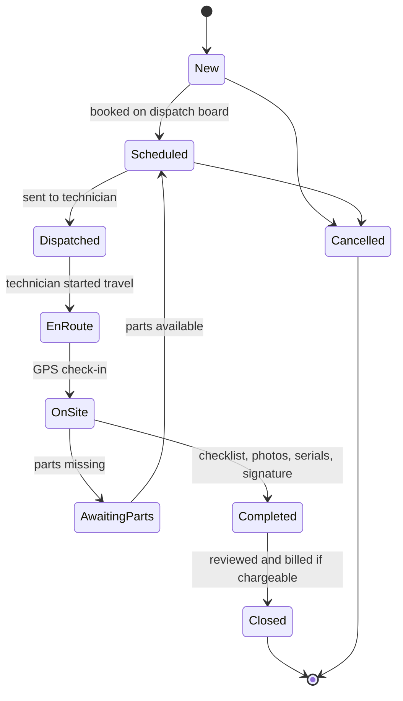

# Module 06 — Field Service, Installed Base, Warranty/AMC & Helpdesk (الخدمة الميدانية والأصول المركبة والصيانة والدعم)

| | |
|---|---|
| **Phases** | P0 → Phase 4 (work orders, technician PWA, installed base, service-call intake) · P1 → Phase 7b (AMC, SLAs, full helpdesk, portal) · P2 → later |
| **Benchmarked** | ServiceTitan, simPRO, Jobber, Housecall Pro, Salesforce Field Service (Agentforce), Dynamics 365 Field Service + Connected Field Service, Zoho FSM, Odoo Field Service, D-Tools Cloud; Zendesk, Freshdesk, Zoho Desk |
| **Business owner** | Operations / Service Manager |

## 1. Goals
1. One **installed-base registry**: every device Motqinon installs is known by site → building → floor → unit, serial, MAC, IP, firmware, install date and warranty end.
2. Technicians run their day from a **mobile PWA** (Arabic, offline-tolerant): jobs, navigation, checklists, photos, serial scanning, signature, service report sent by WhatsApp.
3. Every warranty call or fault becomes a **ticket → work order** with an automatic coverage decision (warranty / AMC / chargeable).
4. Grow **recurring revenue** with AMC contracts, preventive visits and (Phase 7c) IoT monitoring.

## 2. Feature backlog

### 2.1 Installed base (asset registry)
| ID | Feature | Adopted from | P | Notes |
|----|---------|-------------|---|-------|
| FSM-01 | Location hierarchy per site: building → floor → unit/apartment → room/riser/rack | D365 functional locations, ThingsBoard asset relations | P0 | Apartment numbers double as the intercom directory |
| FSM-02 | Asset hierarchy (door panel → lock → exit button; switch → indoor units) | D365, Salesforce | P0 | |
| FSM-03 | Technical attributes per device type: serial, MAC, IP/VLAN, firmware, SIP extension, door direction, install & commissioning dates | simPRO, Zoho FSM, D365 | P0 | Attribute templates per product category |
| FSM-04 | Asset timeline (work orders, tickets, parts, test readings, firmware changes) | All FSMs | P0 | |
| FSM-05 | Bulk import/export of device schedules (Excel) | Common | P0 | Towers have hundreds of devices |
| FSM-06 | Warranty records per asset: Motqinon installation warranty (2 years from acceptance) vs manufacturer warranty | simPRO, D365, D-Tools | P0 | Created automatically at handover (module 05) |
| FSM-07 | QR label per device/unit → asset page or pre-filled WhatsApp fault report | Jetbuilt Service Desk (QR tickets) | P1 | Residents scan the sticker |
| FSM-08 | Test readings & defects history | simPRO | P1 | |
| FSM-09 | 10-year spare-parts obligation: installed models vs spare stock and end-of-life dates | Gap in all benchmarks | P2 | Contract clause turned into data |
| FSM-10 | Credentials vault link (encrypted, audited reveal) | Gap in benchmarks | P1 | See module 05 PRJ-31 |

### 2.2 Work orders, scheduling & dispatch
| ID | Feature | Adopted from | P | Notes |
|----|---------|-------------|---|-------|
| FSM-20 | Work-order types: survey · installation · commissioning · corrective · preventive · warranty · inspection — type drives checklist, billing, SLA | D365, Salesforce, ServiceTitan | P0 | |
| FSM-21 | Work orders from project tasks, tickets, AMC schedules and IoT alarms (source kept) | D365, Salesforce | P0 | |
| FSM-22 | Dispatch board: lanes per technician/crew over time + unscheduled queue, drag-and-drop | ServiceTitan, D365 schedule board, Zoho FSM, Salesforce, Odoo Planning | P0 | |
| FSM-23 | Multi-day crew bookings (installation crew + programmer) | ServiceTitan, Odoo, D365 | P0 | |
| FSM-24 | Job templates (incident types): default tasks, duration, skills, parts | D365 incident types, Salesforce work plans | P1 | e.g., "indoor monitor swap", "face DB re-enrolment" |
| FSM-25 | Map view with live technician location | Zoho FSM, Salesforce, D365, ServiceTitan | P1 | |
| FSM-26 | Skills/certification matching (brand certificates, fire-alarm interface, LoRaWAN) | Salesforce, D365, Zoho FSM, ServiceTitan Dispatch Pro | P1 | |
| FSM-27 | Arrival windows & promised times respecting prayer/heat/Ramadan rules | Salesforce, D365, Jobber | P1 | KSA-specific constraints (module 05 §4) |
| FSM-28 | "Top-3 suggested technicians" with reasons → later AI auto-scheduling | ServiceTitan Dispatch Pro, Agentforce scheduling (GA May 2025), D365 Scheduling Operations Agent | P2 | Start with explainable suggestions |
| FSM-29 | Route optimisation | Jobber (Oct 2025), Salesforce, D365 | P2 | Low value at current job density |

### 2.3 Technician PWA
| ID | Feature | Adopted from | P | Notes |
|----|---------|-------------|---|-------|
| FSM-40 | Today's jobs, customer contact, one-tap navigation (Google Maps deep link) | All; D365 Copilot mobile | P0 | |
| FSM-41 | Check-in/out with GPS stamp; automatic timesheet (travel/work) | Odoo v19 GPS on timer | P0 | PDPL notice for location capture |
| FSM-42 | Dynamic checklists/forms per job type (mandatory steps, readings, photos) | Odoo worksheets, simPRO, D365, Salesforce | P0 | Arabic labels |
| FSM-43 | Photos/videos/voice notes with upload queue for weak signal | All | P0 | |
| FSM-44 | Barcode/QR scan of serials & MACs; on-site asset registration bound to a unit | simPRO, Odoo barcode, Salesforce | P0 | Builds the installed base |
| FSM-45 | Parts used from van stock (with serials in/out) | Odoo, D365, Salesforce | P0 | Stock moves in module 07 (Phase 5); recorded as data before that |
| FSM-46 | Customer signature + bilingual service report PDF sent via WhatsApp | Odoo, Salesforce, D365, Jobber | P0 | |
| FSM-47 | Stage-gate on completion: no "completed" without photos, serials, checklist, signature | Zoho Blueprint pattern | P0 | Drives "job completion compliance" KPI |
| FSM-48 | Offline mode: cached jobs + outbox; later full sync engine if needed | Salesforce, D365 offline profiles; PowerSync/Zero | P1 | Basements and new towers |
| FSM-49 | Geofence validation of check-ins | D365 (unverified) | P1 | |
| FSM-50 | On-site follow-up quote (upsell monitors, smart locks) | ServiceTitan, Jobber, Housecall Pro, simPRO | P1 | Uses module 03 |
| FSM-51 | AI job wrap-up (Arabic narrative from checklist + photos) and guided troubleshooting from manuals | Agentforce (June 2025), ServiceTitan Atlas, D365 Copilot | P2 | Module 12 |
| FSM-52 | Remote video assist (WhatsApp/Teams video + annotated snapshots saved to the job) | Teams replaces D365 Remote Assist (retired) | P2 | No AR headsets |

### 2.4 Service contracts, AMC & warranty claims
| ID | Feature | Adopted from | P | Notes |
|----|---------|-------------|---|-------|
| FSM-60 | **Entitlement check** at ticket/work-order creation: warranty, AMC or chargeable | Salesforce entitlements, D365 | P0 | Stops free work on out-of-warranty devices |
| FSM-61 | AMC / service agreements: coverage (sites, assets), tier, term, visits per year, response times, price | D365 agreements, Salesforce, ServiceTitan memberships, D-Tools service plans, simPRO | P1 | Offered at handover when warranty starts |
| FSM-62 | Preventive-visit generation (recurrence, lead time, pre-booking) | D365, Zoho FSM, simPRO Maintenance Planner, Salesforce | P1 | |
| FSM-63 | Recurring contract billing (ZATCA e-invoices) independent of visits | D365 invoice setups, ServiceTitan, D-Tools | P1 | Module 08 |
| FSM-64 | SLA tiers per contract (business hours vs 24/7) | Salesforce milestones, Zendesk, Freshdesk, Zoho Desk | P1 | |
| FSM-65 | Renewals with reminders and price uplift | D365, ServiceTitan | P1 | |
| FSM-66 | RMA / vendor warranty claims with serial swap | Salesforce return orders, Odoo Repairs, D-Tools | P1 | Vendor warranty tracked separately |
| FSM-67 | Contract profitability (cost of visits vs revenue) | simPRO Maintenance Planner | P2 | |

### 2.5 Helpdesk
| ID | Feature | Adopted from | P | Notes |
|----|---------|-------------|---|-------|
| FSM-80 | Service-call intake from WhatsApp, phone log and web form → ticket | Zendesk, Freshdesk, Zoho Desk | P0 | Helpdesk-lite in Phase 4 |
| FSM-81 | Caller/sender matched to customer → site → unit → device (phone or WhatsApp BSUID) | Jobber AI Receptionist (caller ID match) | P0 | |
| FSM-82 | One-click ticket → work order, links kept | D365 case → WO, Salesforce, Zoho Desk + FSM | P0 | |
| FSM-83 | SLA policies with business-hour clocks (Ramadan calendar) and escalations | Zendesk, Freshdesk, Zoho Desk | P1 | |
| FSM-84 | Macros / canned replies (Arabic) usable on WhatsApp tickets | Zendesk, Freshdesk, Zoho Desk | P1 | |
| FSM-85 | Knowledge base (public + internal, Arabic, how-to videos) | Zoho Desk (40+ languages), Zendesk Knowledge Builder | P1 | |
| FSM-86 | Routing & assignment rules | Zendesk, Freshdesk, Zoho Desk | P1 | |
| FSM-87 | "Technician on the way" + ETA, appointment reminders, CSAT one-tap survey over WhatsApp | Jobber, Housecall Pro, Salesforce Appointment Assistant, Zendesk | P1 | Utility templates; send technician name/photo in advance |
| FSM-88 | First-line AI agent on WhatsApp (identify unit → device → entitlement, collect photo/video, open ticket) with human hand-off | Zendesk AI agents, Freshdesk Freddy, Zoho Zia (Arabic) | P2 | Test on Hijazi dialect |
| FSM-89 | Agent copilot (summaries, drafts, sentiment) | Freshdesk Copilot, Zendesk | P2 | |

## 3. Work-order lifecycle

## 4. Design rules
1. **One location tree and one asset tree**: work orders, tickets, agreements and IoT alarms all reference `site_location` and `installed_asset`.
2. Coverage (warranty / AMC / chargeable) is **computed** when a ticket or work order is created and stored with the reason.
3. The ThingsBoard asset tree mirrors the ERP location tree, so alarms roll up per customer/site (module 12).
4. Resident personal data (names, phones in the intercom directory) is personal data under PDPL; **face templates and images are never stored in the ERP**; every credential reveal is logged.

## 5. Screens
Dispatch board · Work-order detail · Technician PWA (My day, Job, Checklist, Scan, Signature, Report) · Installed-base explorer (site tree + device list + asset page) · Ticket inbox · Agreement (AMC) editor · Preventive-maintenance calendar · RMA list.

## 6. Reports (see [module 10](10-reports-bi.md))
F1 Jobs board summary · F2 Installed-base register · F3 Job completion compliance · F4 Devices per technician-day · F5 First-time-fix · F6 Repeat visits · F7 SLA compliance · F8 Technician utilisation · F9 Warranty/AMC expiry pipeline · F10 MTTR & response time.

## 7. Acceptance criteria
- **Phase 4:** 100% of devices installed in new projects registered with serial/MAC and unit; work orders completed only with mandatory evidence; service reports delivered by WhatsApp; warranty calls opened as tickets with automatic coverage decision.
- **Phase 7b:** AMC contracts generate preventive work orders and recurring invoices; SLA timers and escalations active; knowledge base published in Arabic.
