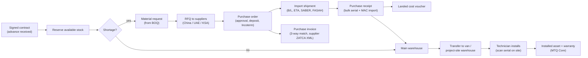

# Module 07 — Inventory, Procurement & Imports (المخزون والمشتريات والاستيراد)

| | |
|---|---|
| **Phases** | Item master sync → Phase 1 · P0 → Phase 5 · P1 → Phase 5 (late) / Phase 7 · P2 → later |
| **Benchmarked** | Odoo 19 (Inventory, Purchase, Barcode, Quality, Repairs), ERPNext v15/16 (Stock, Buying), Oracle NetSuite 2026.1, Dynamics 365 Business Central, SAP Business One 10, Zoho Inventory, Cin7 Core, Fishbowl/Katana |
| **System of record** | **ERPNext** (stock ledger, valuation, purchasing, serials) — MTQ Core owns BOQ-driven demand, technician consumption and the installed base |
| **Business owner** | Operations Manager with Storekeeper/Purchaser |

**Where each capability is implemented:** **E** = ERPNext standard (configuration) · **X** = `mtq_ksa` Frappe extension (custom fields/doctypes) · **C** = MTQ Core (TypeScript) · **C↔E** = Core UI/automation over ERPNext data.

## 1. Goals
1. Every device is traceable from supplier PO → receipt (serial + MAC) → warehouse/van → project → installed unit → warranty/RMA.
2. Signed contracts reserve stock and generate purchase demand automatically, protecting the 45–60 working-day delivery commitment.
3. True landed cost (freight, duty, clearance) flows into margins; import compliance (SABER, CST, FASAH) is tracked per model and shipment.
4. Technicians consume stock from vans/project sites through the PWA without accounting knowledge.

## 2. Procure-to-install flow

## 3. Feature backlog

### 3.1 Item master & compliance
| ID | Feature | Where | Adopted from | P | Notes |
|----|---------|-------|-------------|---|-------|
| INV-01 | SKU (legacy codes kept), bilingual name/description, brand, model, MPN, category tree, typed specs | C→E | All | P0 | Commercial master in Core, synced to ERPNext *Item* |
| INV-02 | UoM with purchase/sale conversion (Cat6: box of 305 m ↔ metre) | E | Odoo, ERPNext, BC, B1, NetSuite, Cin7 | P0 | |
| INV-03 | Multiple barcodes per item/UoM (EAN/GS1/vendor carton codes) | E | Odoo GS1, BC, B1, ERPNext, Zoho, Cin7 | P0 | |
| INV-04 | Supplier catalogue per item (vendor SKU, price, currency, MOQ, lead time, validity, preferred; last-price history) | E | Odoo, ERPNext, BC, B1, NetSuite | P0 | Factory vs local distributor |
| INV-05 | HS code (12-digit GCC) + country of origin + dated duty-rate table | E + X | Odoo, ERPNext, BC, NetSuite; B1 customs groups | P0 | Duty estimate on POs |
| INV-06 | Two warranty clocks: supplier warranty and Motqinon's 2-year customer warranty | E + C | ERPNext Serial No, BC item tracking, B1 | P0 | |
| INV-07 | Linked labor/service item (installation, programming) | C | BC, NetSuite, ERPNext | P0 | Replaces the sheet's install-cost column |
| INV-08 | **Compliance certificates per model** (SABER PCoC, shipment SCoC, CST type approval, IECEE RC) with expiry → warn/block PO or sale | X + C | Not native anywhere — differentiator | P0 | Radio devices (Wi-Fi, Zigbee, BLE, LoRa) need CST approval |
| INV-09 | Variants (finishes, 7" vs 10" monitors) | E | Odoo, ERPNext, BC, NetSuite | P1 | |
| INV-10 | Substitutes and lifecycle/EOL status | E | BC, B1, ERPNext | P1 | Supports the 10-year spare-parts obligation |

### 3.2 Kits & availability
| ID | Feature | Where | Adopted from | P | Notes |
|----|---------|-------|-------------|---|-------|
| INV-20 | Kits / product bundles ("apartment intercom kit") exploding into components | E + C | Odoo kits, ERPNext Product Bundle, NetSuite, BC, B1, Zoho, Cin7 | P0 | Same packages as CPQ (module 03) |
| INV-21 | Reservation of stock for a contract when the advance is received | E (Stock Reservation) + C trigger | Odoo, ERPNext v15, BC, NetSuite, Cin7 | P0 | |
| INV-22 | Projected quantity (on hand − reserved + incoming) shown in the quote catalog panel | C↔E | Odoo, ERPNext, BC, B1, NetSuite | P0 | |
| INV-23 | Parametric/template BoM (qty = f(floors, apartments, entrances)) | C | B1 template BOM, BC | P1 | Generates the BOQ |
| INV-24 | ATP using inbound shipments' ETAs and the KSA calendar; "material readiness %" per contract | C↔E | NetSuite supply allocation, BC ATP/CTP | P1 | |
| INV-25 | Reorder rules & replenishment suggestions (fast movers: PSUs, exit buttons, cable, maglocks) | E | Odoo, ERPNext, BC, B1, NetSuite, Zoho, Cin7 | P1 | |
| INV-26 | Pipeline-weighted demand (open quotes × win % × kit explosion) for long-lead imports | C | Cin7 ForesightAI / NetSuite Demand Planning (pattern) | P2 | Better than time-series for project businesses |

### 3.3 Warehouses & stock operations
| ID | Feature | Where | Adopted from | P | Notes |
|----|---------|-------|-------------|---|-------|
| INV-30 | Warehouses: Makkah HQ, Jeddah store, **technician vans** (custodian), **project sites**, transit, quarantine/RMA | E | All | P0 | |
| INV-31 | Transfers with in-transit step | E | BC, NetSuite, ERPNext, B1, Zoho, Cin7 | P0 | Makkah ↔ Jeddah ↔ vans |
| INV-32 | Issue-to-project with cost posted to the project dimension; returns from site | E + C | ERPNext stock entry + project, BC | P0 | Consumption vs BOQ report |
| INV-33 | Technician consumption & returns posted from the work order (PWA) | C→E | Odoo FS stock deduction, D365, Salesforce | P0 | |
| INV-34 | Backorders on partial receipts/deliveries | E | All | P0 | Partial containers |
| INV-35 | Full stock-take (year-end, Zakat) | E | All | P0 | |
| INV-36 | Mobile scanning PWA: receive, transfer, issue, count by camera | C↔E | Odoo Barcode, NetSuite WMS, Zoho/Cin7 apps | P0 | Same scanner as the technician app |
| INV-37 | Bins/putaway, cycle counts, van min/max refill, label printing (QR per serial) | E + C | Odoo, ERPNext, BC, B1, NetSuite | P1 | |
| INV-38 | Drop-ship from a local distributor to site (serials captured at installation) | E | Odoo, ERPNext, NetSuite, BC, B1, Zoho, Cin7 | P1 | |
| INV-39 | Quality inspection at receipt (power-on, firmware check) | E | Odoo Quality, ERPNext QI | P1 | |
| INV-40 | Proof of delivery (signature/photo); delivery released only after the 40% payment | C | Odoo | P1 | Project gate (module 05) |
| INV-41 | Vendor consignment stock | E | NetSuite 2026.1, Odoo owner | P2 | |

### 3.4 Serials & traceability
| ID | Feature | Where | Adopted from | P | Notes |
|----|---------|-------|-------------|---|-------|
| INV-50 | Serial tracking on every move for all devices | E | All | P0 | Lots only for cable reels/batteries (P2) |
| INV-51 | **Bulk serial + MAC import at receipt** from the supplier packing list | E + X | Odoo, Cin7, BC | P0 | MAC validated (12 hex, OUI); multiple MACs per device |
| INV-52 | Up/down traceability: supplier/PO ↔ customer/site/unit | E + C | Odoo, BC item tracing, ERPNext, B1, NetSuite | P0 | Recalls & warranty claims |
| INV-53 | Serial → installed asset link (scan-to-commission: bind to building/unit, start warranty) | C | B1 equipment cards, BC service items (pattern) | P0 | Differentiator |

### 3.5 Procurement
| ID | Feature | Where | Adopted from | P | Notes |
|----|---------|-------|-------------|---|-------|
| INV-60 | Material requests generated from the contract BOQ minus reserved stock | C→E | ERPNext Material Request, NetSuite requisitions, B1, BC | P0 | |
| INV-61 | Multi-currency POs (USD/CNY) with exchange rates, Incoterms, deposits (typical 30% T/T) | E | All; BC/B1/NetSuite prepayments | P0 | |
| INV-62 | PO approval limits by amount/role (e.g., > SAR 20k → founder) | E + C approvals | Odoo, BC, NetSuite, B1, ERPNext, Zoho | P0 | |
| INV-63 | Back-to-back PO lines linked to contract/project lines | E + C | Odoo MTO, NetSuite/BC special orders, ERPNext | P0 | Feeds project costing |
| INV-64 | Partial receipts with tolerances; 3-way match (PO–receipt–bill) blocks paying unreceived quantities | E | All | P0 | |
| INV-65 | RFQ to multiple suppliers and bid comparison on landed cost + lead time | E | ERPNext RFQ/Supplier Quotation comparison, Odoo call for tenders, B1 wizard | P1 | |
| INV-66 | Supplier e-invoice ingestion: parse ZATCA UBL XML into the purchase invoice; validate supplier VAT, VAT arithmetic and Motqinon's own VAT/address | X | BC E-Documents, Odoo UBL import | P1 | Deterministic, no OCR needed for KSA suppliers |
| INV-67 | OCR/AI capture for foreign proformas/commercial invoices and packing lists (pre-create serial records) | C (AI gateway) | BC Payables Agent, NetSuite Intelligent Bill Capture, Odoo digitisation | P1 | Human approval |
| INV-68 | Vendor master with KSA fields (unified number, VAT, national address, IBAN, currency, terms) | C→E | All (custom) | P0 | |
| INV-69 | Vendor scorecards (on-time %, lead time, RMA rate), supplier portal, blanket agreements | E | ERPNext scorecard/portal, Odoo, BC | P2 | |

### 3.6 Import logistics & landed cost
| ID | Feature | Where | Adopted from | P | Notes |
|----|---------|-------|-------------|---|-------|
| INV-70 | Import shipment record: POs, B/L/AWB, containers, vessel, ETD/ETA, status (ordered → shipped → arrived → clearing → released → received), broker | X | NetSuite Inbound Shipment | P0 (lite) | |
| INV-71 | Customs declaration capture (FASAH no./date, duty, import VAT, fees): duty & fees → landed cost; import VAT → input VAT | X + E | Not native | P0 | Import VAT is recoverable, never a cost |
| INV-72 | Landed-cost allocation by value/qty/weight/volume, one charge across several receipts | E (Landed Cost Voucher) | Odoo, ERPNext, BC, B1, NetSuite, Zoho (multi-bill 2025) | P0 | |
| INV-73 | Moving-weighted-average perpetual valuation (IFRS; no LIFO) | E | All | P0 | |
| INV-74 | Document checklist per shipment (CI, PL with SN/MAC, B/L, CoO, SABER SCoC, CST cert, insurance, declaration, delivery order, broker invoice) | X | Not native — differentiator | P1 | |
| INV-75 | Estimated → actual landed cost (accrual %, true-up on final bills); landed-cost % by supplier/lane feeds quote pricing | X + C | B1 (partial) | P1 | |
| INV-76 | ETA risk alerts against contract delivery windows | C | NetSuite supply allocation | P1 | Protects the 45–60-day commitment |

### 3.7 Returns, RMA & warranty
| ID | Feature | Where | Adopted from | P | Notes |
|----|---------|-------|-------------|---|-------|
| INV-80 | Warranty replacement (swap): failed serial out, new serial in, installed base updated (incl. MAC in intercom/SIP config) | C↔E | B1 service calls, BC service orders, Odoo Repairs, ERPNext Warranty Claim | P0 | |
| INV-81 | Customer returns/RMA to quarantine; restock or scrap | E | NetSuite, BC, Odoo, ERPNext, B1, Zoho, Cin7 | P1 | |
| INV-82 | Return to vendor with debit note; back-to-back supplier warranty claim | E + C | NetSuite VRA, BC, B1 | P1 | Recover cost within supplier warranty |
| INV-83 | Repair orders (bench repairs, parts + labor) | E | Odoo Repairs, BC, B1, ERPNext | P1 | |
| INV-84 | Spare-parts obligation planning (installed base by model vs spares & EOL → last-time-buy alerts) | C | Not native — differentiator | P2 | 10-year contract clause |

## 4. Saudi import & trade compliance built in
| Requirement | Where in the system | Control |
|-------------|--------------------|---------|
| SABER (SASO): product registration, **PCoC per model** (≈ 1 year), **SCoC per shipment** | `compliance_cert` (X) | Warn/block POs when the PCoC is missing/expired; shipment can't enter *clearing* without SCoCs |
| CST type approval for radio/IoT devices (Wi-Fi, Zigbee, BLE, LoRa, cellular) | Item radio flags + certificate (X) | Certificate mandatory when a radio flag is set |
| FASAH customs declaration (≥ 48 h before arrival), CIF valuation, duty (mostly 5%; some electrical lines 15% since Jul 2024; ITA lines may be 0%) | Import shipment (X) + dated HS duty table | Duty estimate on PO; variance vs actual declaration |
| Import VAT 15% on (CIF + duty), recoverable | Purchase/landed-cost posting (E) | Posted to input VAT with the declaration reference |
| Supplier ZATCA e-invoices (cleared UBL XML or PDF/A-3) | Purchase invoice (X) | Keep original file; validate VAT and totals |
| National address on vendors, customers and sites | Party master (C) | Required fields |

*Indicative HS codes and duty rates must be confirmed with a customs broker or the ZATCA tariff search before use.*

## 5. Reports (see [module 10](10-reports-bi.md))
I1 Stock on hand & valuation · I2 Reorder/low stock · I3 Stock movement ledger · I4 Reserved vs available by contract · I5 Serial traceability · I6 Slow-moving stock · I7 Van stock by technician · I8 Inventory turnover · PU1 Open POs & expected receipts · PU2 Spend by supplier · PU3 3-way-match exceptions · PU4 Purchase price variance · PU5 Supplier on-time delivery · PU6 Import landed cost · plus **consumption vs BOQ per project**.

## 6. Acceptance criteria (Phase 5 exit)
- Every purchase goes through an approved PO; every received device has a serial (and MAC where applicable) captured at receipt.
- A signed contract with advance received shows reserved stock and generated material requests without manual re-typing.
- Landed cost of at least one import shipment allocated and reflected in item valuation and quote margins.
- First cycle count at ≥ 98% accuracy; technician consumption from vans posts correctly to the project.
