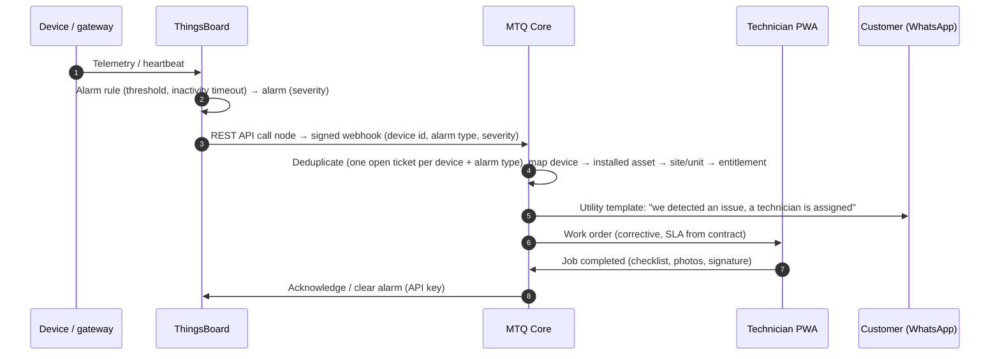

# Module 12 — IoT-Connected Service & AI (الخدمة المتصلة بإنترنت الأشياء والذكاء الاصطناعي)

| | |
|---|---|
| **Phases** | Selected AI helpers → Phases 2–4 (P1) · IoT-connected service & AI agents → Phase 7c · P2 → later |
| **Benchmarked** | Dynamics 365 Connected Field Service, ThingsBoard 4.2/4.3 (alarms, rule engine, REST API call node, AI Request node, API keys), Azure/AWS IoT patterns; AI: Salesforce Agentforce, HubSpot Breeze agents, Zoho Zia (LLM + Agent Studio + MCP), Odoo 19 AI, Dynamics 365 Copilot & agents (Sales Order, Payables, Finance, Scheduling), NetSuite AI Connector (MCP), D-Tools Quote Assist & MCP server, Procore Helix, ServiceTitan Atlas |
| **Business owner** | Founder (IoT solutions architect) |

## 1. Why this module matters
Motqinon's founder is building an **end-to-end IoT company**. The platform should therefore do what generic ERPs don't: know every installed device, watch its health, open service work automatically, and turn monitoring into **recurring revenue** — while AI removes the typing (BOQs, reports, summaries) and never takes decisions that belong to people.

## 2. IoT-connected service (ThingsBoard ↔ MTQ Core)

| ID | Feature | Adopted from | P | Notes |
|----|---------|-------------|---|-------|
| IOT-01 | Device ↔ installed-asset binding (ThingsBoard device name = serial/MAC); ThingsBoard asset tree mirrors the ERP location tree (site → building → floor → unit) | D365 CFS, ThingsBoard relations | P1 | Alarms roll up per customer/site |
| IOT-02 | Provision ThingsBoard devices/customers from the installed base at commissioning | — | P1 | Scan-to-commission (module 06) |
| IOT-03 | **Alarm → ticket → work order** with severity mapping and entitlement check | D365 CFS (alert → case → WO), ThingsBoard REST call node | P1 (P0 for IoT product lines) | Signed webhooks, idempotent |
| IOT-04 | Alert aggregation & dedup (one active ticket per device + alarm type; 5-minute window) | D365 CFS, ThingsBoard | P1 | Prevents ticket floods |
| IOT-05 | Alarm state sync (ack/clear from ticket closure, via ThingsBoard API keys) | ThingsBoard 4.3 | P1 | |
| IOT-06 | Heartbeat/offline detection for IP intercoms via the ThingsBoard IoT Gateway (ping/SNMP) | ThingsBoard inactivity timeout | P1 | Where vendor clouds don't expose APIs |
| IOT-07 | Per-site health dashboards embedded in the customer portal | ThingsBoard customer dashboards | P1 | Module 11 |
| IOT-08 | Remote commands (reboot, config, test) with audit | D365 CFS commands, ThingsBoard RPC | P2 | Saves site visits |
| IOT-09 | OTA firmware campaigns tracked per device | ThingsBoard OTA, AWS IoT Jobs | P2 | Often via vendor clouds |
| IOT-10 | **Uptime-based SLAs** and "monitoring" AMC tier (availability % per site) | ThingsBoard calculated fields → Core | P2 | Recurring revenue |
| IOT-11 | Predictive triage: trends (battery, lock cycles, PoE draw) + LLM-written triage note | D365 CFS analytics, ThingsBoard AI Request node (4.2) | P2 | |
| IOT-12 | Event-driven billing: commissioning event (devices online & programmed) drafts the final 10% payment request and customer sign-off | — (Motqinon-specific) | P2 | Module 08 |

## 3. AI features (consolidated)

### 3.1 Guardrails (P0 as soon as any AI writes data)
- **AI gateway:** all model calls go through Core — PII redaction/minimisation, per-feature prompts, cost budgets, logging of inputs/outputs, model/provider abstraction (Claude API by default).
- **Human approval** for anything that leaves the company, touches the ledger, issues a document or changes a price. AI **never** issues ZATCA documents.
- **Role-scoped context:** the assistant only sees what the user may see (same permission checks as the API).
- **PDPL:** data sent to providers outside KSA is minimised and covered by transfer safeguards; biometric data never goes to AI.
- **Evaluation:** Arabic (MSA + Hijazi dialect) test sets per feature before release.

### 3.2 Feature list
| ID | Feature | Adopted from | P | Phase | Notes |
|----|---------|-------------|---|-------|-------|
| AI-01 | **BOQ → draft quote**: parse consultant BOQ (XLSX/PDF/photo), match rows to catalog SKUs with confidence, add labor/packages, keep BOQ refs, human review | D-Tools Quote Assist (Sep 2026), Portal.io AI Proposal Builder, Jetbot, BC Sales Order Agent | P1 | 3–4 | **Flagship** for an integrator |
| AI-02 | Reply drafting & AR↔EN translation (WhatsApp/e-mail, product descriptions) | HubSpot, Salesforce, Zoho, Odoo, Dynamics | P1 | 2 | MSA vs dialect toggle |
| AI-03 | Visit/meeting summaries from Arabic voice notes → structured notes & next steps | Odoo, HubSpot Call Recap, Salesforce | P1 | 2–4 | Technicians prefer voice |
| AI-04 | Natural-language search & filters ("unpaid invoices Jeddah > 60 days") | Odoo 19 NL→domain, Ask Zia | P1 | 3+ | |
| AI-05 | Supplier documents: packing-list & foreign-invoice extraction (serials/MACs, lines) → drafts for approval | BC Payables Agent, NetSuite Intelligent Bill Capture, Odoo digitisation | P1 | 5 | KSA supplier invoices parsed from UBL, not OCR |
| AI-06 | **Read-only MCP server** exposing role-scoped tools (search customers, get quote/contract/project, stock availability, AR balance, installed devices) so staff can use Claude/other assistants safely | Salesforce Hosted MCP, HubSpot MCP, NetSuite AI Connector, Zoho MCP, D-Tools MCP | P1 | 4+ | Writes later, only via approval flows |
| AI-07 | Service-report narrative in Arabic generated from checklist + photos; guided troubleshooting from vendor manuals (RAG) | Agentforce FS, ServiceTitan Atlas, D365 Copilot | P2 | 7 | |
| AI-08 | "Project watchdog": approvals past SLA, unpaid milestones, aging snags, delivery clock at risk | Smartsheet PM agent, Planner PM agent, monday agents | P2 | 7 | |
| AI-09 | WhatsApp assistant (business-specific): identify unit → device → entitlement, collect photo/video, open ticket, book survey; human hand-off | Zendesk AI agents, Freshdesk Freddy, Zia (Arabic), respond.io, Jobber AI Receptionist | P2 | 7 | Meta policy compliant |
| AI-10 | Knowledge-base drafting from resolved tickets (Arabic) | Zendesk Knowledge Builder | P2 | 7 | |
| AI-11 | Collections assistant (personalised reminders, promise-to-pay tracking) | D365 Finance Agent, QuickBooks | P2 | 7 | |
| AI-12 | Anomaly detection (discount outliers, margin leakage, duplicate bills, stock shrinkage) | Zia, Tableau Next Inspector, Sage GL Outlier Detection | P2 | 7 | Needs 6–12 months of data |
| AI-13 | Cash-flow forecasting from milestones, PDCs, AP, payroll and pipeline | D365 Finance Agent, Xero, NetSuite | P2 | 7 | |
| AI-14 | Scheduling suggestions ("top-3 technicians" with reasons → later auto-scheduling) | ServiceTitan Dispatch Pro, Agentforce FS, D365 Scheduling Operations Agent | P2 | 7 | Explainable first |
| AI-15 | Contract clause checks against the approved library; key-term extraction from client-issued contracts | DocuSign Iris agents | P2 | 7 | Legal review stays human |
| AI-16 | Arabic labor-law/HR policy assistant citing sources | Jisr "Momtathl" | P2 | 7 | |

## 4. Acceptance criteria (Phase 7c exit)
- Pilot sites: every ThingsBoard alarm of configured severity creates exactly one ticket/work order linked to the right device and unit; closing the job clears the alarm.
- Customer portal shows site health for pilot customers; at least one monitoring/AMC offer priced on uptime.
- BOQ → draft quote reaches ≥ 80% correct SKU matches on a test set of 10 real consultant BOQs, with every line reviewable.
- All AI calls are logged in the gateway with user, feature, cost and outcome; no AI action writes data without an approval record.
